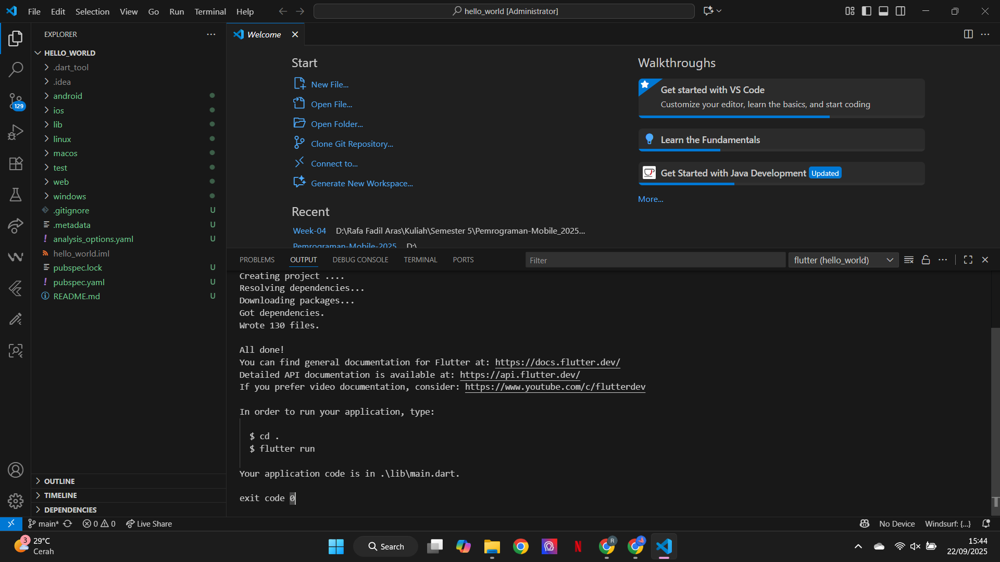
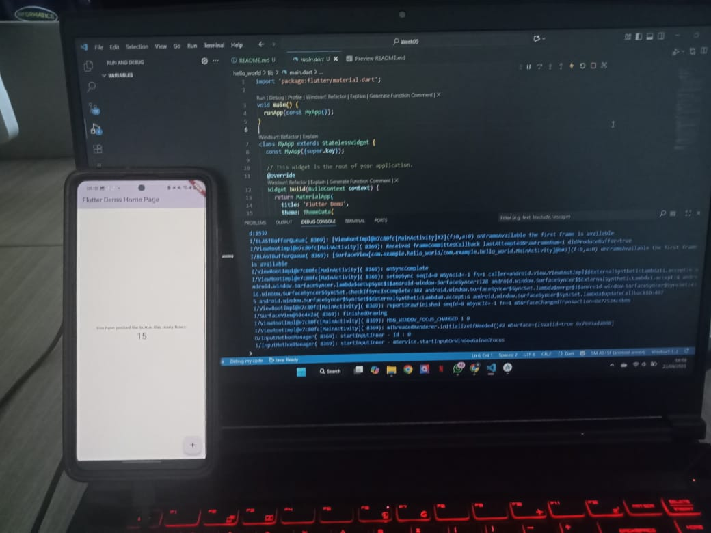

# Pemrograman Mobile - Pertemuan 5

**Nama : Rafa Fadil Aras**

**NIM  : 2341720007**

## Tugas Praktikum 

**Soal 1**

Selesaikan Praktikum 1 - 5

**Jawab**

- **Praktikum 1 : Membuat Project Flutter Baru**
  
    Project Flutter berhasil dibuat
    

- **Praktikum 2 : Menghubungkan Perangkat Android**
    
    Perangkat Android berhasil tersambung
    

- **Praktikum 3 : Membuat repository Github dan laporan praktikum**
  
    

- **Praktikum 4**
- **Praktikum 5**