# Pemrograman Mobile - Pertemuan 5

**Nama : Rafa Fadil Aras**

**NIM  : 2341720007**

## Tugas Praktikum 

**Soal 1**

Selesaikan Praktikum 1 - 5

**Jawab**

- **Praktikum 1 : Membuat Project Flutter Baru**
  
    Project Flutter berhasil dibuat
    

- **Praktikum 2 : Menghubungkan Perangkat Android**
    
    Perangkat Android berhasil tersambung
    

- **Praktikum 3 : Membuat repository Github dan laporan praktikum**
  
    - Membuat repository baru 
  
        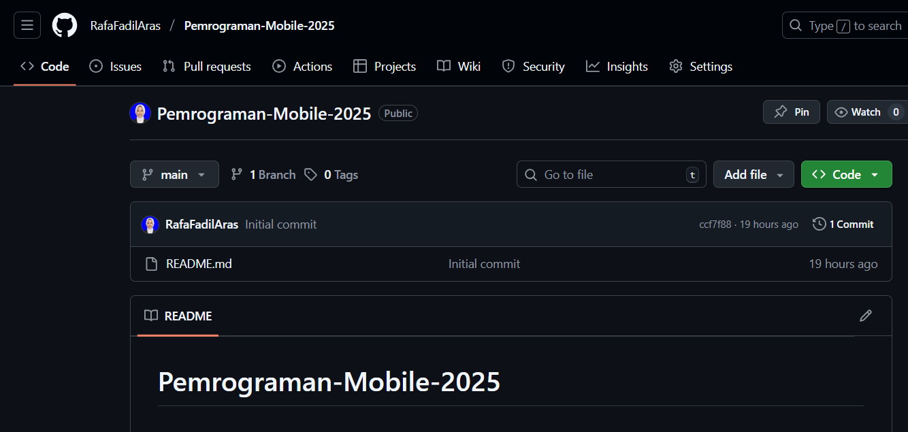

    - Commit gitignore dan project hello world
  
        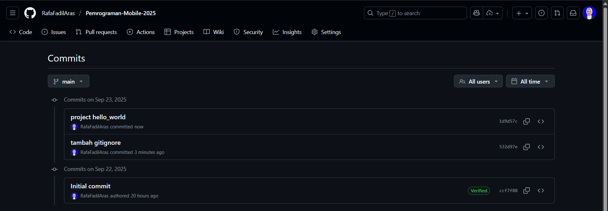

    - Running project 

        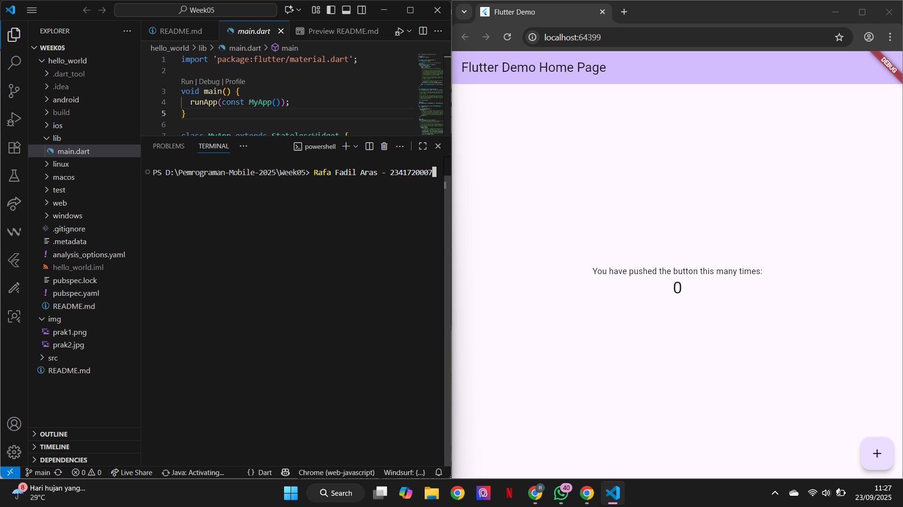

- **Praktikum 4 : Menerapkan Widget Dasar**

    - Langkah 1 : Text Widget

        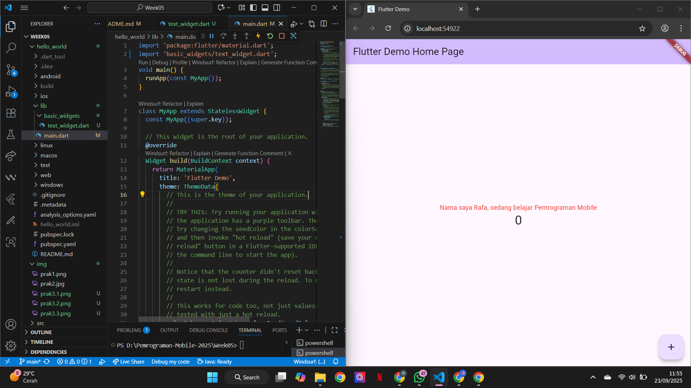

    - Langkah 2 : Image Widget
  
        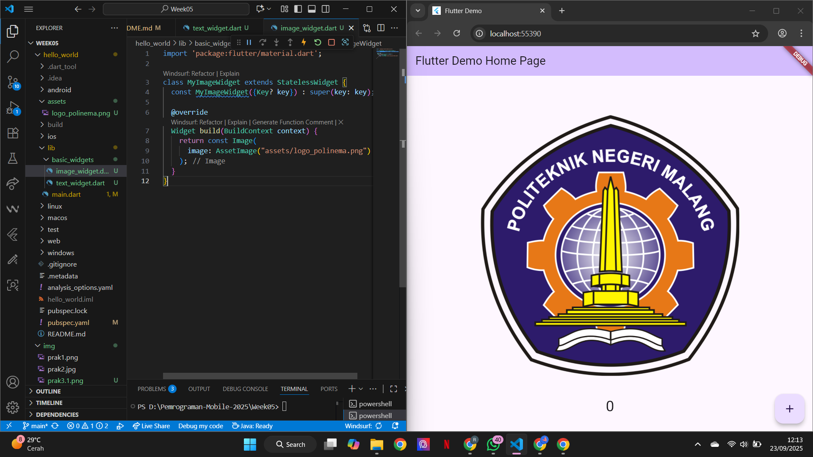

- **Praktikum 5 : Menerapkan Widget Material Design dan iOS Cupertino**

    - Langkah 1 : Cupertino Button dan Loading Bar

        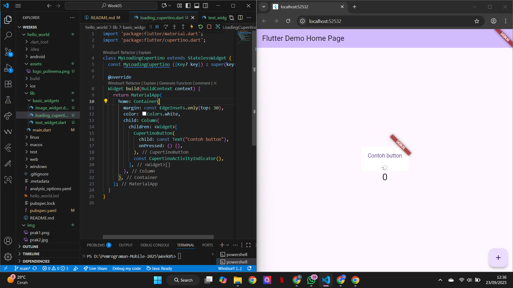
    
    - Langkah 2 : Floating Action Button (FAB)

        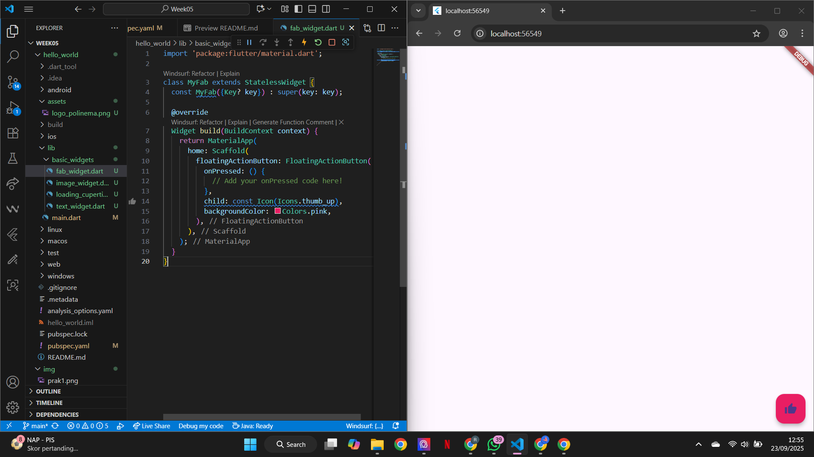
    
    - Langkah 3 : Scaffold Widget

        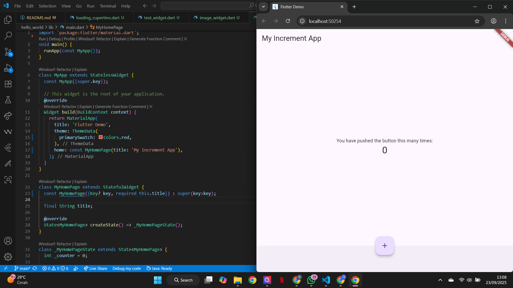
    
    - Langkah 4 : Dialog Widget

        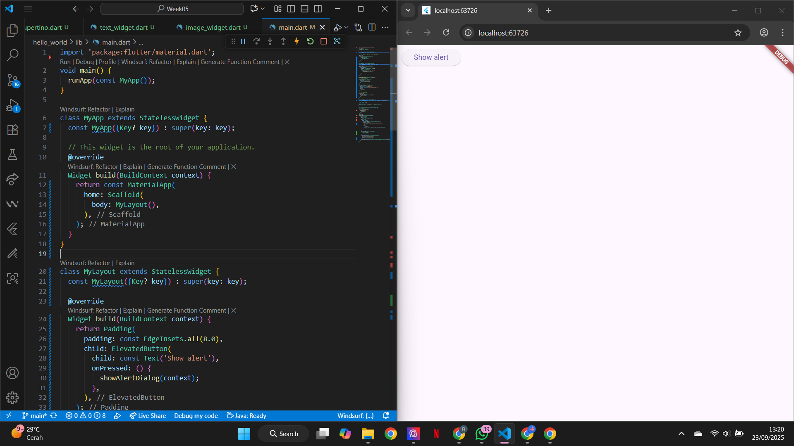

    - Langkah 5 : Input dan Selection Widget

        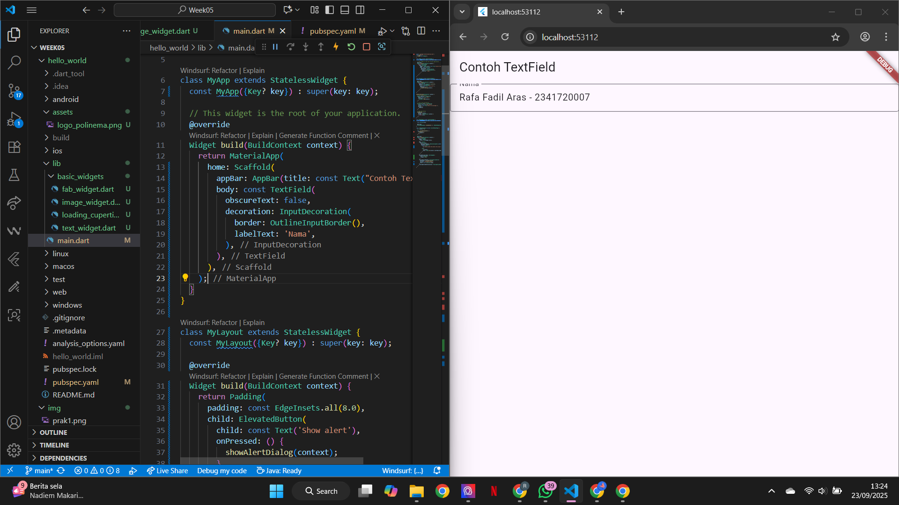
    
    - Langkah 6 : Date and Time Pickers

        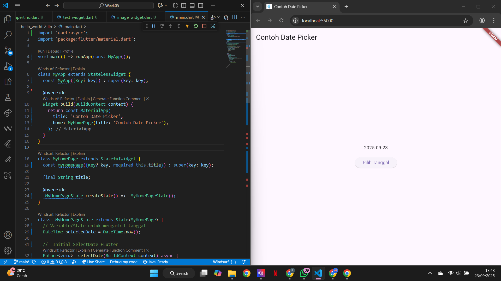

**Soal 2**

Selesaikan Praktikum 2, menjalankan aplikasi hello_world pada perangkat fisik (device Android)

**Jawab**

Perangkat Android berhasil tersambung
    

**Soal 3**

Selesaikan Praktikum 5 

**Jawab**

Sudah terselesaikan. 

**Soal 4**

Selesaikan Codelabs: Your first Flutter app

**Jawab**

- **Menambahkan tombol**
  
    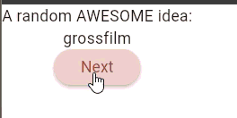

- **Memperindah tampilan aplikasi**
  
    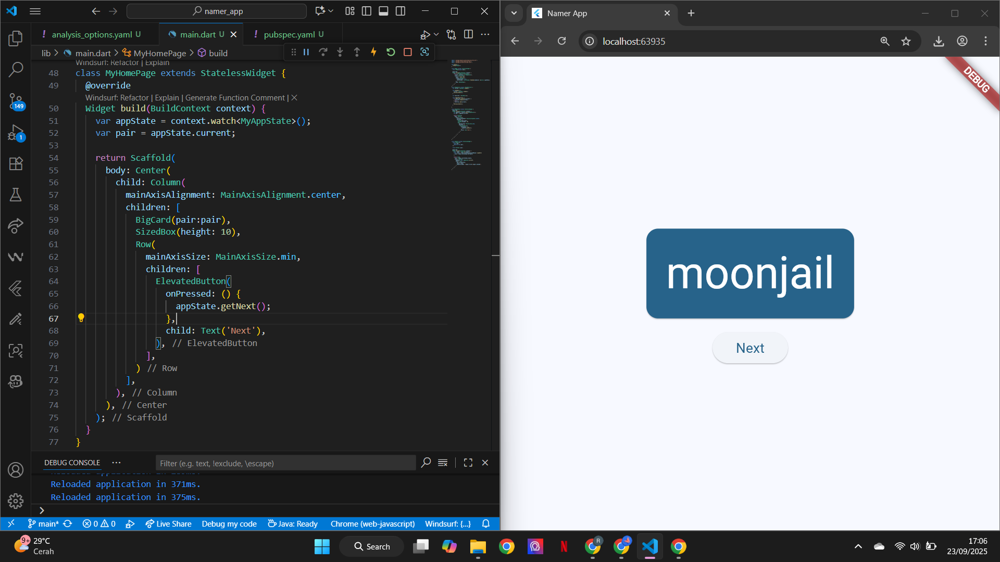

- **Menambahkan fungsi**
  
    

- **Menambahkan kolom samping navigasi**
  
    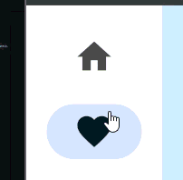

    

    

- **Menambahkan halaman baru**

    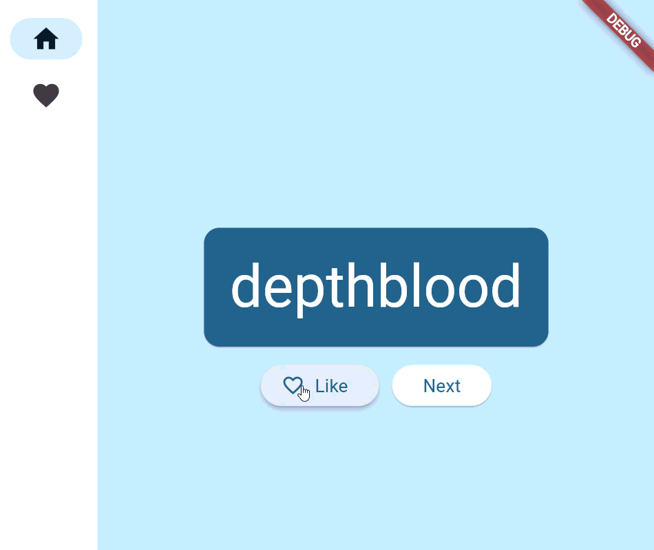

