# Pemrograman Mobile - Pertemuan 5

**Nama : Rafa Fadil Aras**

**NIM  : 2341720007**

## Tugas Praktikum 1

### **Soal 1**

Selesaikan praktikum 1-4 

**- Praktikum 1 : Membangun Layout di Flutter**

- Langkah 1
  
  Membuat project baru
  
- Langkah 2
  
  Menulis kode program 

  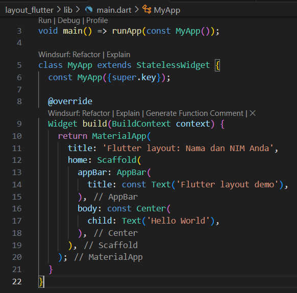

  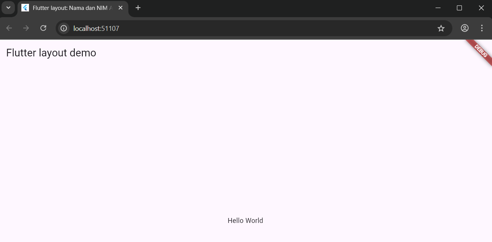

- Langkah 3
  
  Identifikasi layout diagram

- Langkah 4

  Implementasi title row

  - soal 1

    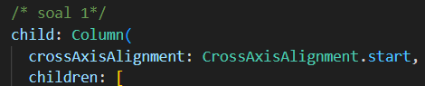

  - soal 2

    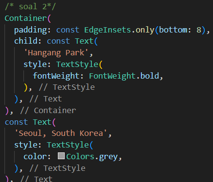

  - soal 3
  
    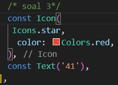

**- Praktikum 2 : Implementasi button row**

- Langkah 1
  
  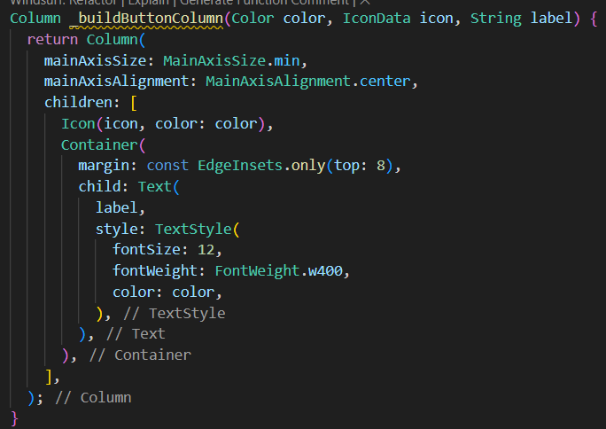

- Langkah 2
  
  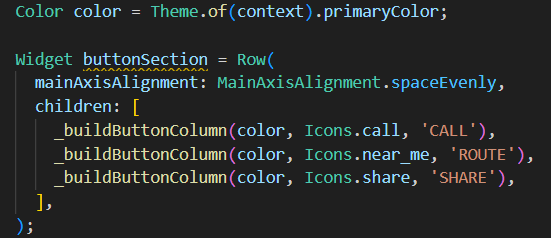

- Langkah 3
  
  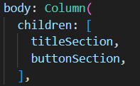

- Hasil 

  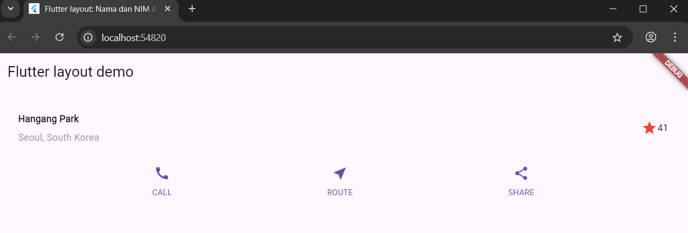

**- Praktikum 3 : Implementasi text section**

- Langkah 1
  
  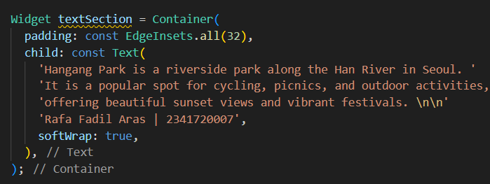

- Langkah 2
  
  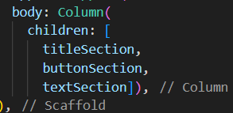

- Hasil
  
  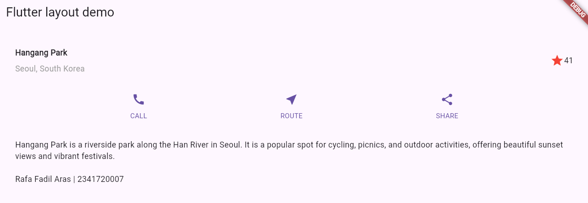

**- Praktikum 4 : Implemetasi image section**

- Langkah 1
  
  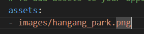

- Langkah 2
  
  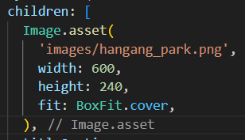

- Langkah 3
  
  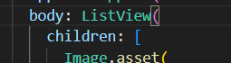

- Hasil 
  
  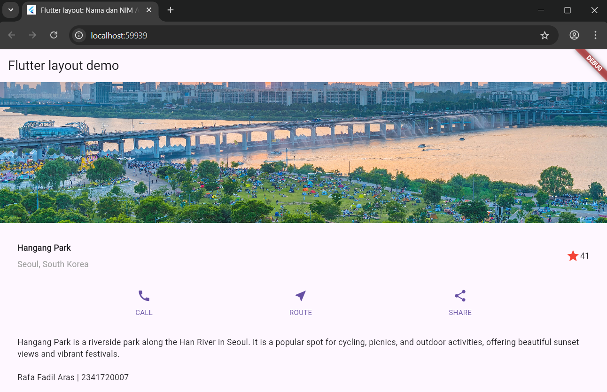

### **Soal 2**

Membuat project basic_layout_flutter

  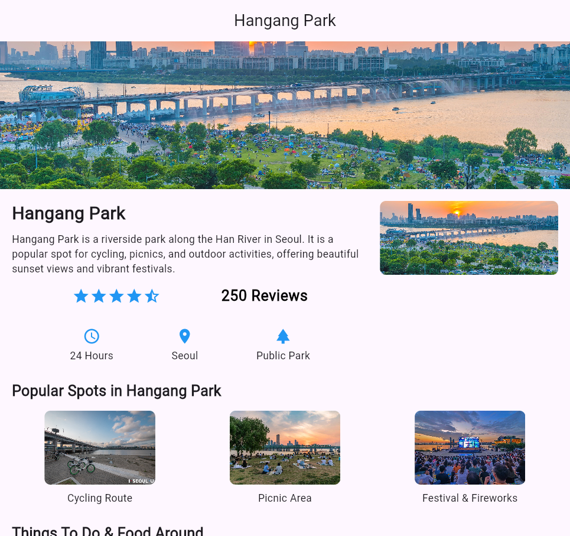

  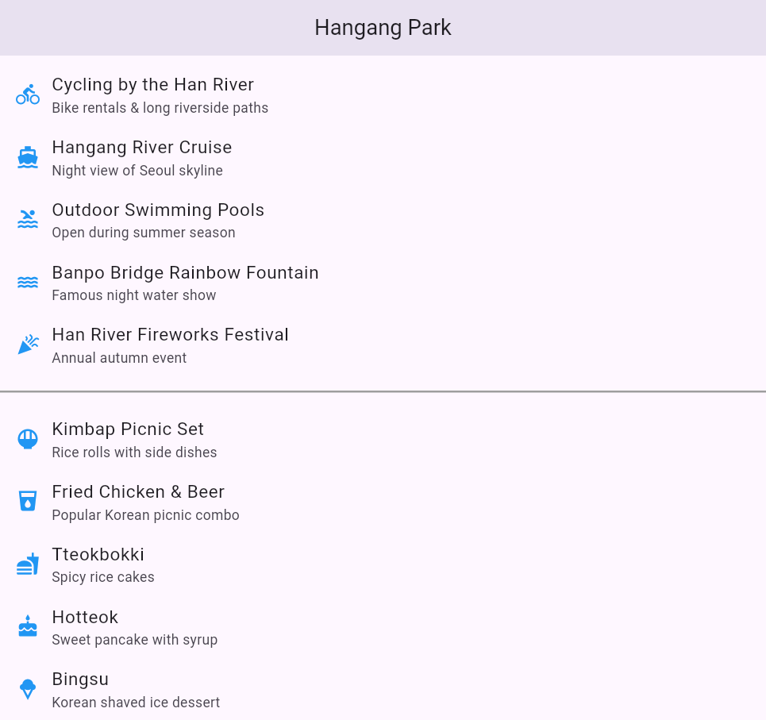

**- Praktikum 5 : Implemetasi image section**

- Langkah 1
  
  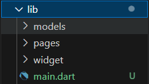

- Langkah 2
  
  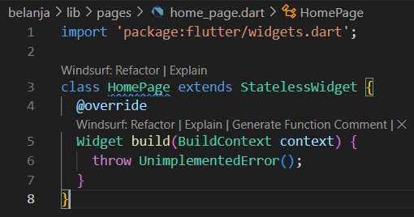

- Langkah 3
  
  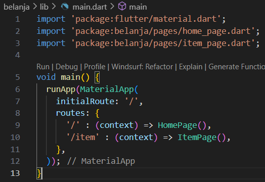

- Langkah 4
  
  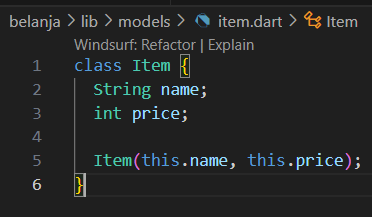

- Langkah 5
  
  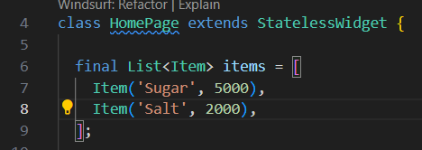

- Langkah 6
  
  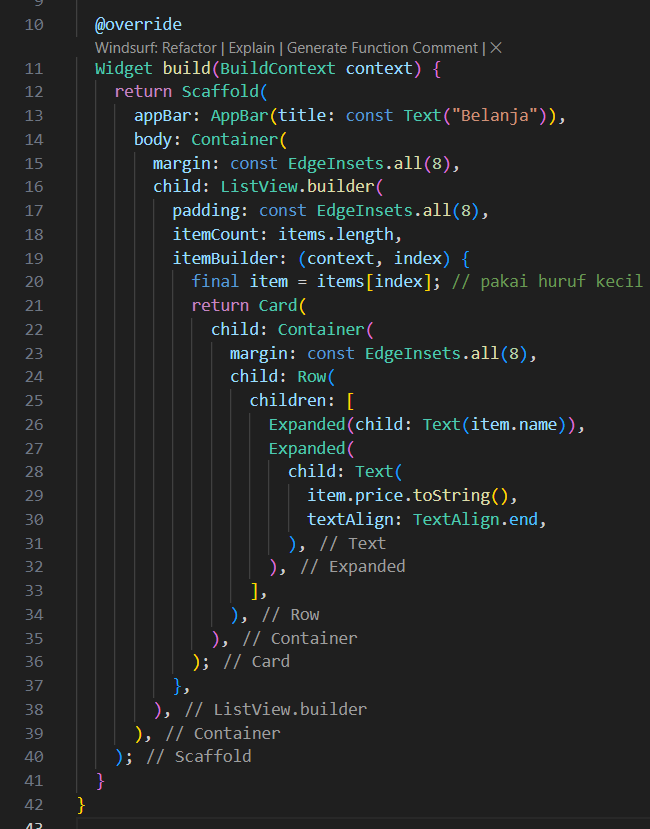

  Hasil : 

  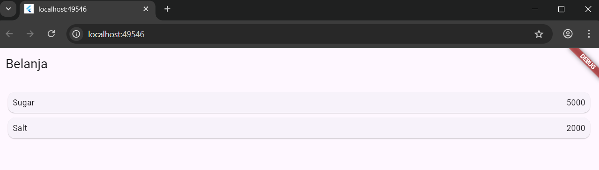

## Tugas Praktikum 2

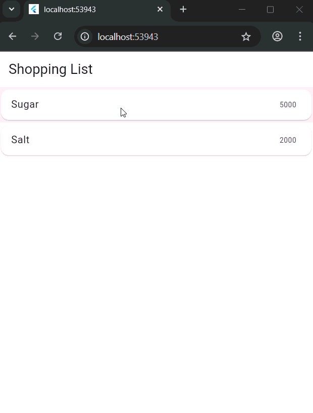

