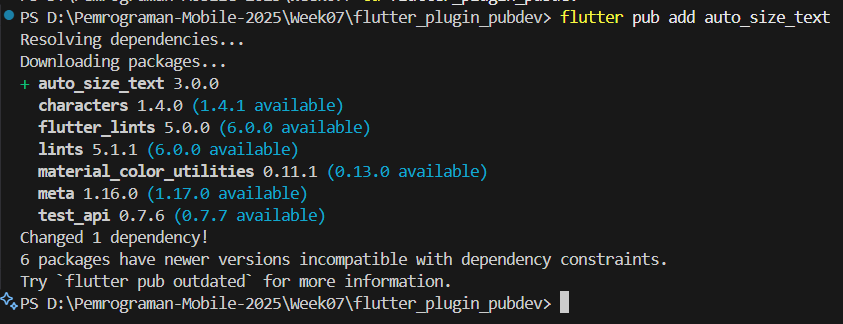

# Pemrograman Mobile - Pertemuan 7

**Nama : Rafa Fadil Aras**

**NIM  : 2341720007**

## Tugas Praktikum 1

**Soal 1**

Selesaikan Praktikum 

- Praktikum Menerapkan Plugin di Project Flutter
  
  - Langkah 1 - Buat project baru

    

  - Langkah 2 - Menambahkan Plugin

    

  - Langkah 3 -  Buat file red_text_widget.dart
    
    

  - Langkah 4 - Tambah Widget AutoSizeText

    

    Penjelasan : setelah menambahkan kode tersebut, terdapat 2 error. Pertama, undefined name 'text' karena variabel text belum didefinisikan. Kedua, menunjukkan bahwa flutter tidak mengenali widget AutoSizeText karena belum ada import statement untuk package auto_size_text. 

  - Langkah 5 - Buat Variabel text dan parameter di constructor
  
    

  - Langkah 6 - Tambahkan widget di main.dart

    

    Hasil : 

    

**Soal 2**

Jelaskan maksud dari langkah 2 pada praktikum tersebut!

Jawaban : pada langkah tersebut adalah dilakukan proses penambahan sebuah package atau pustaka eksternal bernama auto_size_text ke dalam sebuah proyek Flutter untuk membuat widget teks yang ukurannya dapat menyesuaikan secara otomatis

**Soal 3**

Jelaskan maksud dari langkah 5 pada praktikum tersebut!

Jawaban : pada langkah 5 digunakan untuk membuat RedTextWidget dapat menerima data teks dari luar. Caranya dengan menambahkan variabel text dan sebuah parameter required pada constructor-nya, sehingga saat widget ini dibuat, kita wajib memberikan teks yang ingin ditampilkan.

**Soal 4**

Pada langkah 6 terdapat dua widget yang ditambahkan, jelaskan fungsi dan perbedaannya!

Jawaban : Perbedaannya adalah Container pertama yang berwarna kuning (lebar 50) membungkus sebuah widget kustom RedTextWidget yang memiliki gaya khusus, sedangkan Container kedua yang berwarna hijau (lebar 100) membungkus widget Text standar bawaan Flutter. 

**Soal 5**

Jelaskan maksud dari tiap parameter yang ada di dalam plugin auto_size_text berdasarkan tautan 

Jawaban : 
- key : mengontrol bagaimana satu widget menggantikan widget lain di dalam tree
- textKey : mengatur key nutuk widget Text yag dihasilkan
- style : untuk mengatur gaya text seperti jenis font, ketebalan dan warna
- minFontSize : untuk menentukan ukuran font terkecil (nilai standar nya 12)
- maxFontSize : untuk menentukan ukuran font terbesar. Jika tidak diatur, nilainya diambil dari style
- stepGranularity : untuk mengatur kelipatan perubahan font saat mengecil. 
- presetFontSizes : menyediakan daftar ukuran font yang sudah ditentukan.
- maxLines : untuk membatasi jumlah baris maksimum untuk teks
- group : memungkinkan beberapa widget untuk memiliki ukuran font yang sama.
- overflow : menentukan apa yag terjadi jika teks masih tidak muat setelah mencapai minFontSize 
- wrapWords : mengatur apakah teks harus dipotong diantar kata-kata atau diantara karakter
- overflowReplacement : untuk menampilkan widget lain sebagai pengganti jika teks tidak muate (overflow)
- textAlign : untuk mengatur bagaimana teks harus diratakan secara horizontal
- semanticsLabel : untuk tujuan aksebilitas (memberikan konteks atau makna yang lebih jelas kepada pengguna dengan gangguan penglihatan) 