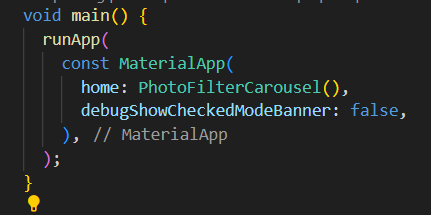

# Pemrograman Mobile - Pertemuan 9 (Kamera)

**Nama : Rafa Fadil Aras**

**NIM  : 2341720007**

## Tugas Praktikum 1

**Soal 1**

Selesaikan Praktikum 

- Praktikum 1 - Mengambil foto dengan kamera di flutter
  - Langkah 1 - Buat project baru

    

  - Langkah 2 - Tambah dependensi
  
    

  - Langkah 3 - Ambil sensor kamera
  
    

  - Langkah 4 - Buat dan inisialisasi CameraController
  
    

  - Langkah 5 - Gunakan CameraPreview untuk menampilkan preview foto
  
    

  - Langkah 6 - Ambil foto dengan CameraController

    

  - Langkah 7 - Buat widget baru DisplayPictureScreen
  
    

  - Langkah 8 - Edit main.dart
  
    

  - Langkah 9 - Menampilkan hasil foto
  
    

  - Hasil 

    
    

- Praktikum 2 - Membuatt photo filter carousel
  - Langkah 1 - Buat project baru
  
    

  - Langkah 2 - Buat widget Selector ring dan dark gradient
  
    

  - Langkah 3 - Buat widget photo filter carousel
  
    

  - Langkah 4 - Membuat filter warna - bagian 1
  
    

  - Langkah 5 - Membuat filter warna

    

  - Langkah 6 - Implementasi filter caraousel
  
    

**Soal 2**

Menggabungkan praktikum 1 dan 2 

- Hasil 
  
  

**Soal 3**

Jelaskan maksud void async pada praktikum 1?

Jawaban : void async adalah fungsi yang tidak mengembalikan nilai tetapi menjalankan operasi yang bersifat asinkron (bisa menunggu sesuatu dengan await).

**Soal 4**

Jelaskan fungsi dari anotasi @immutable dan @override ?

Jawaban : @immutable berfungsi untuk menjaga agar widget atau objek tidak bisa diubah setelah dibuat untuk menjaga stabilitas UI flutter, sedangkan @override digunakan untuk menandai bahwa method menimpa method dari superclass. 