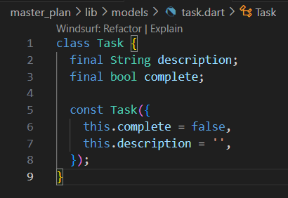
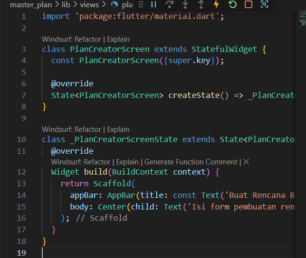

# Pemrograman Mobile - Pertemuan 10 (Dasar State Management)

**Nama : Rafa Fadil Aras**

**NIM  : 2341720007**

## Tugas Praktikum 1 - Dasar State dengan Model-View

### Langkah-langkah praktikum 

- Langkah 1 - Buat project baru
  
    

- Langkah 2 - Membuat model task.dart

    

- Langkah 3 - Buat file plan.dart
  
    

- Langkah 4 - Buat file datae_layer.dart

    

- Langkah 5 - Pindah ke file main.dart
  
    

- Langkah 6 - Buat plan_screen.dart
  
    

- Langkah 7 - buat method _buildAddTaskButton()
  
    

- Langkah 8 - Buat widget _buildList()
  
    

- Langkah 9 - Buat widget _buildTaskTile
  
    
  
- Langkah 10 - Tambah scroll controller
  
    

- Langkah 11 - Tambah scroll listener
  
    

- Langkah 12 - Tambah controller dan keyboard behavior
  
    

- Langkah 13 - Tambah method dispose()
  
    
  
- Hasil 
  
    

### Pertanyaan 

1. Jelaskan maksud dari langkah 4 pada praktikum tersebut! Mengapa dilakukan demikian?
   
   Langkah ini bertujuan untuk membuat satu file bernama data_layer.dart yang berfungsi sebagai penghubung antara file di folder models. Kode nya hanya berupa perintah export untuk export file plan.dart dan task.dart, jadi ketika file lain membutuhkan dua model tersebut cukup melakukan satu kali impor ke data_layer.dart saja tanpa perlu impor masing-masing file. Sehingga, struktur kode lebih rapi dan efisien. 

2. Mengapa perlu variabel plan di langkah 6 pada praktikum tersebut? Mengapa dibuat konstanta ?
   Variabel plan digunakan untuk menyimpan data utama yang berisi nama rencana dan daftar tugas yang akan ditampilkan. Variabel tersebut penting karena setiap perubahan pada daftar tugas, dilakukan dengan memperbarui isi dari plan. Nilainya dibuat konstanta agar efisien, karena pada saat pertama kali aplikasi dijalankan data nya masih kosong dna belum berubah. 

3. Lakukan capture hasil dari Langkah 9 berupa GIF, kemudian jelaskan apa yang telah Anda buat!
   
   .gif)

   Setelah melakukan langkah 1 - 9, outputnya adalah menampilkan seetiap tugas dari daftar plan secara dinamin menggunakan ListTile. Setiap barisnya terdiri dari checkbox untuk menandai dan TextForm Field utuk menulis atau mengubah deskripsi tugas. 

4. Apa kegunaan method pada Langkah 11 dan 13 dalam lifecyle state ?
   
   initState() untuk menyiapkan dan mengaktifkan controller saat awal, dispose() untuk menonaktifkan dan membersihkan controller di akhir, sehingga keduanya dapat menjaga widget agar berjalan efisien. 

## Tugas Praktikum 2 - Mengelola Data Layer dengan InheritedWidget dan InheritedNotifier

### Langkah-langkah praktikum 

- Langkah 1 - Buat file plan_provider.dart
  
    

- Langkah 2 - Edit main.dart
  
    
  
- Langkah 3 - Tambah method pada model plan.dart
  
    

- Langkah 4 - Pindah ke PlanScreen
  
    

- Langkah 5 - Edit method _buildAddTaskButton
  
    

- Langkah 6 - Edit method _buildTaskTile
  
    

- Langkah 7 - Edit _buildList
  
    

- Langkah 8 - Tetap di class PlanScreen
  
    

- Langkah 9 - Tambah widget SafeArea
  
    

- Hasil

    

### Pertanyaan 

1. Jelaskan mana yang dimaksud InheritedWidget pada langkah 1 tersebut! Mengapa yang digunakan InheritedNotifier ?
   
   InheritedNotifier adalah kelas di flutter untuk membagikan data ke widget turunannya dalam sebuah pohon widget tanpa perlu meneruskan data secara manual melalui paramter. 

2. Jelaskan maksud dari method di langkah 3 pada praktikum tersebut! Mengapa dilakukan demikian?
   
   Method tersebut bertujuan untuk mempermudah akses informasi terkait progress pengerjaan task secara langsung dari objek model tanpa menghitung manual agar logika perhitungan dan format pesan progress berada langsung di model, sehingga UI dapat mengakses informasi tersebut tanpa menghtiung ulang setiap tmapilan. 

3. Lakukan capture hasil dari Langkah 9 berupa GIF, kemudian jelaskan apa yang telah Anda buat!
   
   

   Pada praktikum ini, saya telah membuat sebuah aplikasi flutter manajemen rencana memakai state management native dengan ValueNotifier dan InheritedNotifier. Model plan menyediakan data dan getter untuk menghitung progress task, PlanProvider membagikan state ke seluruh widget tree, dan PlanScreen menampilkan daftar seerta update task secara otomatis sesuai perubahan dengan progress ditampilan di bagian bawah. 

## Tugas Praktikum 3 - Membuat State di Multiple Screens

### Langkah-langkah praktikum 

- Langkah 1 - Edit PlanProvider
  
    

- Langkah 2 - Edit main.dart
  
    
  
- Langkah 3 - Edit plan_screen.dart
  
    

- Langkah 4 - PError
  
    

- Langkah 5 - Tambah getter Plan
  
    

- Langkah 6 - EMethod initState()
  
    

- Langkah 7 - Widget build
  
    

- Langkah 8 - Edit _buildTaskTile
  
    

- Langkah 9 - Buat screen baru
  
    

- Langkah 10 - Pindah ke class _PlanCreatorScreenState
  
    

- Langkah 11 - Pindah ke method build
  
    

- Langkah 12 - Buat widget _buildListCreator
  
    

- Langkah 13 - Buat void addPlan()
  
    

- Langkah 14 - Buat widget _buildMasterPlans()
  
    

- Hasil

    

### Pertanyaan 

1. Berdasarkan Praktikum 3 yang telah Anda lakukan, jelaskan maksud dari gambar diagram berikut ini!
   
   Diagram di sebelah kiri menggambarkan tahap awal ketika aplikasi pertama kali dijalankan, yaitu hierarchy mulai dari MaterialApp, kemudian wrapper state management menggunakan PlanProvider, lalu masuk ke layar utama PlanCreatorScreen yang memiliki struktur berisi Column—mengandung widget input TextField untuk menambah rencana dan Expanded yang menampung ListView daftar rencana. Panah navigator menunjukkan perpindahan layar ketika salah satu plan dipilih sehingga menampilkan diagram di kanan, yaitu widget tree pada layar detail plan: MaterialApp → PlanScreen → Scaffold → Column, dengan dua komponen utama, yaitu daftar task dalam ListView di dalam Expanded, dan informasi progress pada bagian bawah lewat SafeArea dan Text.

2. Lakukan capture hasil dari Langkah 14 berupa GIF, kemudian jelaskan apa yang telah Anda buat!
   
   

   Pada praktikum 3 ini, aplikasi flutter manajemen rencana sudah berhasil menampilkan form untuk menambah plan baru, daftar seluruh plan yang sudah dibuat, serta proses navigasi dan interaksi ke detail plan di mana pengguna bisa menambahkan, mengedit, dan mencentang task pada setiap plan. Setiap perubahan task akan otomatis memperbarui progress yang ditampilkan di bagian bawah layar detail plan, membuktikan state management berjalan reaktif dan konsisten.

