# Pemrograman Mobile - Pertemuan 11 (Pemrograman Asynchronous)

**Nama : Rafa Fadil Aras**

**NIM  : 2341720007**

## Praktikum 1 - Mengunduh Data dari Web Service (API)

### Langkah-langkah praktikum 

- Langkah 1 - Buat project baru
  
    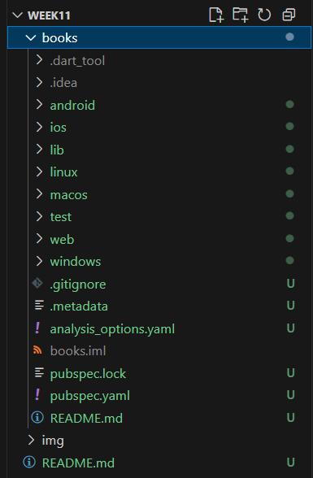

- Langkah 2 - Cek file pubspec.yaml

    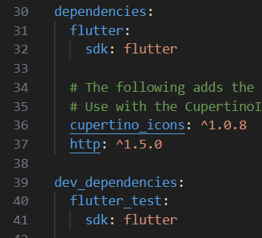

- Langkah 3 - Buka file main.dart
  
    ```dart
        import 'dart:async';
        import 'package:flutter/material.dart';
        import 'package:http/http.dart';
        import 'package:http/http.dart' as http;

        void main() {
        runApp(const MyApp());
        }

        class MyApp extends StatelessWidget {
        const MyApp({super.key});

        @override
        Widget build(BuildContext context) {
            return MaterialApp(
            title: 'Rafa',
            theme: ThemeData(
                primarySwatch: Colors.blue,
                visualDensity: VisualDensity.adaptivePlatformDensity,
            ),
            home: const FuturePage(),
            );
        }
        }

        class FuturePage extends StatefulWidget {
        const FuturePage({super.key});

        @override
        State<FuturePage> createState() => _FuturePageState();
        }

        class _FuturePageState extends State<FuturePage> {
        String result = '';

        @override
        Widget build(BuildContext context) {
            return Scaffold(
            appBar: AppBar(
                title: const Text('Back from the Future'),
            ),
            body: Center(
                child: Column(
                children: [
                    const Spacer(),
                    ElevatedButton(
                    child: const Text('GO!'),
                    onPressed: () {},
                    ),
                    const Spacer(),
                    Text(result),
                    const Spacer(),
                    const CircularProgressIndicator(),
                    const Spacer(),
                ],
                ),
            ),
            );
        }
        }
    ```

  - **Soal 1** 
  
    Menambahkan nama panggilan pada title app

    ```dart
    title: 'Rafa',
    ```

- Langkah 4 - Tambah method getData()
  
    ```dart
      Future<Response> getData() async {
        const authority = 'www.googleapis.com';
        const path = '/books/v1/volumes/junbDwAAQBAJ';
        Uri url = Uri.https(authority, path);
        return http.get(url);
      }
    ```

  - **Soal 2**
    - Mencari judul buku favorit, lalu mengganti ID buku pada variabel path kode tersebut. 
    - Mencoba mengakses di browser URI 
  
        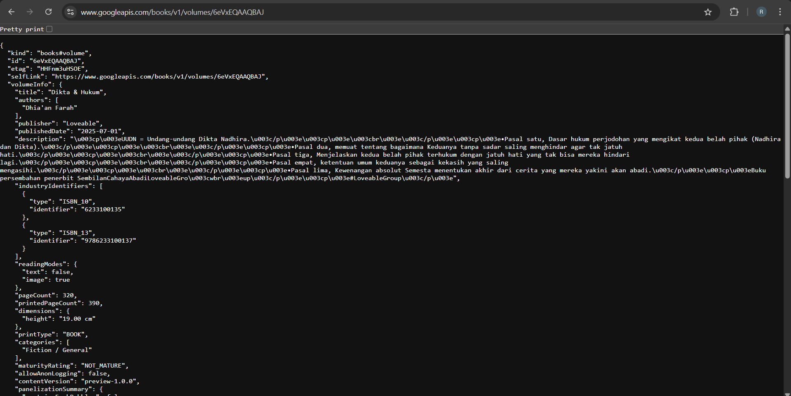
  
- Langkah 5 - Tambah kode di ElevatedButton
  ```dart
    const Spacer(),
            ElevatedButton(
              child: const Text('GO!'),
              onPressed: () {
                setState(() {});
                getData()
                    .then((value) {
                      result = value.body.toString().substring(0, 450);
                      setState(() {});
                    })
                    .catchError((_) {
                      result = 'An error occurred';
                      setState(() {});
                    });
              },
            ),
    ```

  - **Soal 3**
    - Jelaskan maksud kode langkah 5 terkait substring dan catchError

        Kode substring(0,450) digunakan untuk membatasi jumlah karakter dari data yang ditampilkan. saat tombol "GO!" di klik, aplikasi mengambil data dari API Google Books. Kode catchError berfungsi untuk menangani kemungkinan kesalahan saat pengambilan data, seperti koneksi internet yang bermasalah atau URL tidak valid. Jika error, aplikasi tidak akan berhenti tiba-tiba, tetapi akan menampilkan pesan "An error occurred" di layar untuk memberi tahu pengguna. 

    - Hasil

        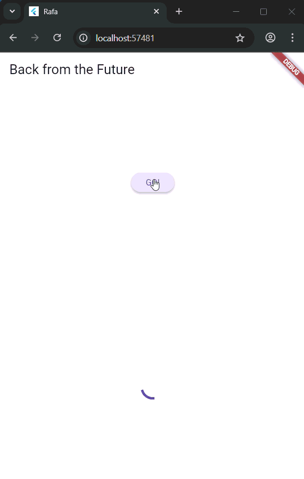

## Praktikum 2 - Menggunakan await/async untuk menghindari callbacks

### Langkah-langkah praktikum 

- Langkah 1 - Buka file main.dart
  
    ```dart
    Future<int> returnOneAsync() async {
        await Future.delayed(const Duration(seconds: 3));
        return 1;
    }

    Future<int> returnTwoAsync() async {
        await Future.delayed(const Duration(seconds: 3));
        return 2;
    }

    Future<int> returnThreeAsync() async {
        await Future.delayed(const Duration(seconds: 3));
        return 3;
    }
    ```

- Langkah 2 - Tambah method count()
  
    ```dart
    Future count() async {
        int total = 0;
        total = await returnOneAsync();
        total += await returnTwoAsync();
        total += await returnThreeAsync();
        setState(() {
            result = total.toString();
        });
    }
    ```

- Langkah 3 - Panggil count()
  
    ```dart
        count();
    ```

- Langkah 4 - Run
  - **Soal 4**
    - Jelaskan maksud kode langkah 1 dan 2
  
        Pada langkah 1, tiga method asynchronous (returnOneAsync(), returnTwoAsync(), dan returnThreeAsync()) digunakan untuk mensimulasikan proses yang memerlukan waktu, seperti mengambil data dari server atau menjalankan perhitungan yang tidak langsung selesai. Masing-masing method menggunakan Future.delayed selama tiga detik sebelum mengembalikan nilai 1, 2, atau 3.

        Pada langkah 2, method count() berfungsi untuk memanggil ketiga method tersebut secara berurutan menggunakan keyword await. Nilai yang dikembalikan dari setiap method dijumlahkan ke dalam variabel total, lalu hasilnya diubah menjadi string dan ditampilkan pada layar melalui setState().

    - Hasil

        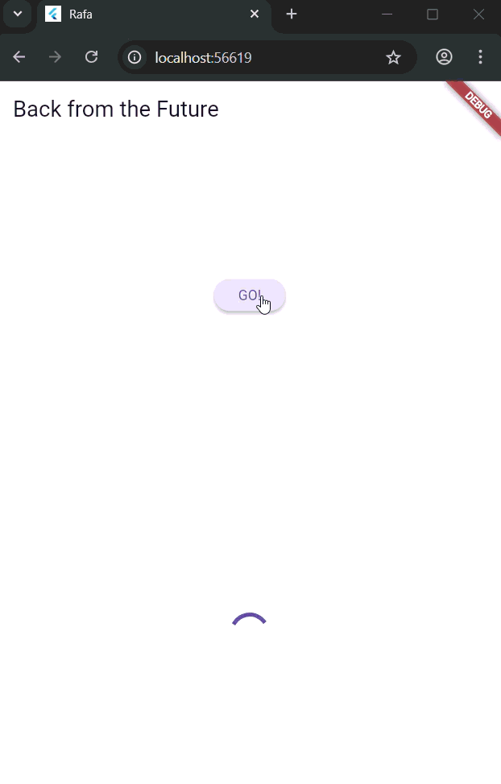

## Praktikum 3 - Menggunakan Completer di Future

### Langkah-langkah praktikum 

- Langkah 1 - Buka main.dart

    ```dart
    import 'package:async/async.dart';
    ```

- Langkah 2 - Tambahkan variabel dan method

    ```dart
    late Completer completer;

    Future getNumber() {
    completer = Completer<int>();
    calculate();
    return completer.future;
    }

    Future calculate() async {
    await Future.delayed(const Duration(seconds : 5));
    completer.complete(42);
    }
    ```

- Langkah 3 - Ganti isi kode onPressed()

    ```dart
    getNumber().then((value) {
            setState(() {
            result = value.toString();
        });
    });
    ```

- Langkah 4 - Run
  - **Soal 5**
    - Jelaskan maksud kode langkah 2

        kode program tersebut membuat proses asynchronous menggunakan Completer. Fungsi getNumber() memulai proses perhitungan dengan memanggil calculate(), lalu calculate() menunggu 5 detik sebelum mengembalikan hasil bernilai 42. Intinya, Completer digunakan agar program bisa menunggu hasil dari proses yang berlangsung secara tidak langsung (asynchronous).

    - Hasil 
  
        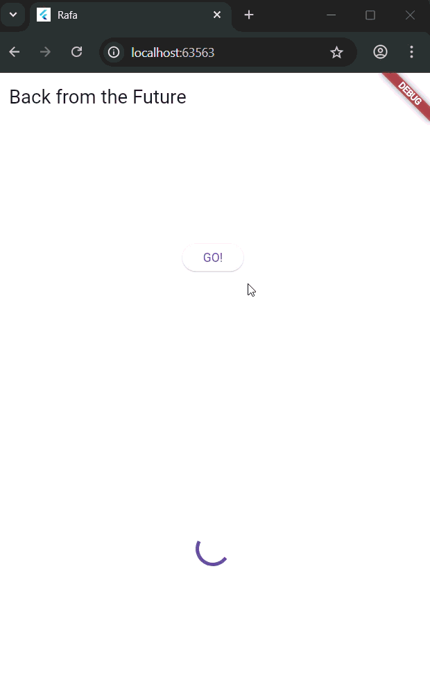
  
- Langkah 5 - Ganti method calculate()

    ```dart
    Future calculate() async {
        try {
            await new Future.delayed(const Duration(seconds: 5));
            completer.complete(42);
        } catch (e) {
            completer.completeError(e);
        }
    }
    ```

- Langkah 6 - Pindah ke onPressed()

    ```dart
    getNumber().then((value) {
        setState(() {
            result = value.toString();
        });
    }).catchError((e) {
        result = 'An error occurred';
    });
    ```

    - **Soal 6**
      - Jelaskan maksud perbedaan kode langkah 2 dengan langkah 5 & 6

        Pada langkah 2, kode hanya menjalankan proses asynchronous sederhana tanpa penanganan kesalahan, sehingga jika terjadi error, program akan berhenti. Sedangkan pada langkah 5 dan 6, kode diperbarui dengan menambahkan blok try-catch di dalam method calculate() dan fungsi catchError() saat memanggil getNumber(). Sehingga program bisa mendeteksi dan menangani error dengan aman, dan memberikan pesanyang sesuai tanpa menyebabkan aplikasi crash.

      - Hasil 
  
        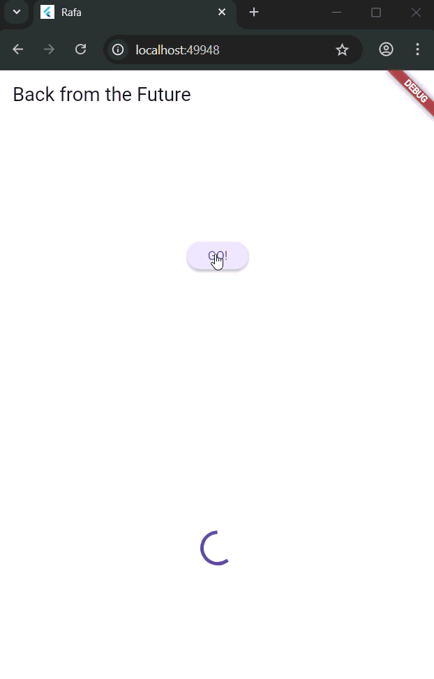

## Praktikum 4 - Memanggil Future secara paralel

### Langkah-langkah praktikum 

- Langkah 1 - Buka file main.dart
  
    ```dart
      void returnFG() {
        FutureGroup<int> futureGroup = FutureGroup<int>();
        futureGroup.add(returnOneAsync());
        futureGroup.add(returnTwoAsync());
        futureGroup.add(returnThreeAsync());
        futureGroup.close();

        futureGroup.future.then((List<int> value) {
        int total = 0;
        for (var element in value) {
            total += element;
        }
        setState(() {
            result = total.toString();
        });
        });
    }
    ```

- Langkah 2 - Edit onPressed()

    ```dart
    returnFG();
    ```

- Langkah 3 - Run
  - **Soal 7**
    
    Capture hasil 

    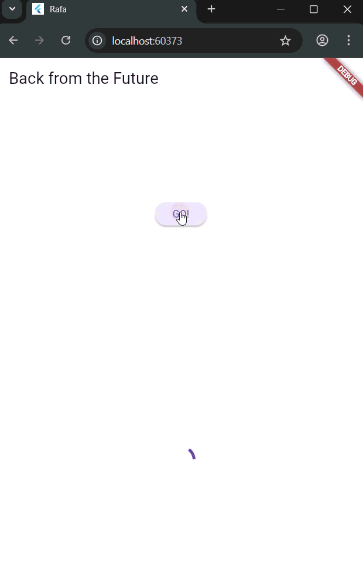
  
- Langkah 4 - Ganti variabel futureGroup

    ```dart
    final futures = Future.wait<int>([
      returnOneAsync(),
      returnTwoAsync(),
      returnThreeAsync(),
    ]);
    ```

  - **Soal 8**
    - Jelaskan maksud perbedaan kode langkah 1 dan 4!

        Perbedaan langkah 1 dan 4 terletak pada cara menjalankan beberapa proses asynchronous secara bersamaan. Pada langkah 1 digunakan FutureGroup, di mana setiap Future harus ditambahkan satu per satu lalu ditutup dengan close(). Sedangkan pada langkah 4 digunakan Future.wait, yang lebih sederhana karena cukup menampung semua Future dalam satu list tanpa perlu membuat objek tambahan. Hasil akhirnya sama, tetapi Future.wait lebih efisien dan mudah dibaca.
  
## Praktikum 5 - Menangani Respon Error pada Async Code

### Langkah-langkah praktikum 

- Langkah 1 - Buka file main.dart

    ```dart
    Future returnError() async {
        await Future.delayed(const Duration(seconds: 2));
        throw Exception('Something terrible happened!');
    }
    ```

- Langkah 2 - ElevatedButton

    ```dart
    returnError()
        .then((value) {
        setState(() {
            result = 'Success';
        });
    }).catchError((onError) {
        setState(() {
            result = onError.toString();
        });
    }).whenComplete(() => print('Complete'));
    ```

- Langkah 3 - Run
  - **Soal 9**
    
    Capture Hasil

    
    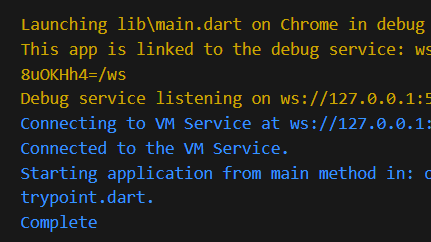

- Langkah 4 - Tambah method handleError()
  
    ```dart
    Future handleError() async {
        try {
        await returnError();
        }
        catch (error) {
        setState(() {
            result = error.toString();
        });
        }
        finally {
        print('Complete');
        }
    }
    ```

  - **Soal 10**
    - Panggil method handleError() di ElevatedButton, lalu run. Apa hasilnya? Jelaskan perbedaan kode langkah 1 dan 4!
    
    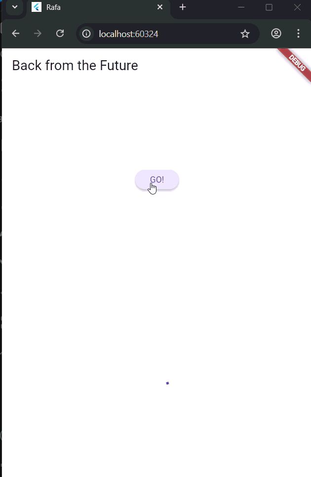
    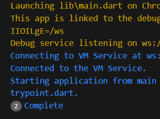

    Hasil pada langkah 4 ini menampilkan teks "Exception: Something terrible happened!" pada layar. Perbedaannya adalah pada langkah 1, method returnError() hanya membuat kesalahan (error) dengan melempar exception setelah menunggu 2 detik, tanpa menanganinya. Sedangkan pada langkah 4, method handleError() memanggil returnError() lalu menangani error-nya dengan try-catch-finally.

## Praktikum 6 - Menggunakan Future dengan StatefulWidget

### Langkah-langkah praktikum 

- Langkah 1 - Install plugin geolocator

    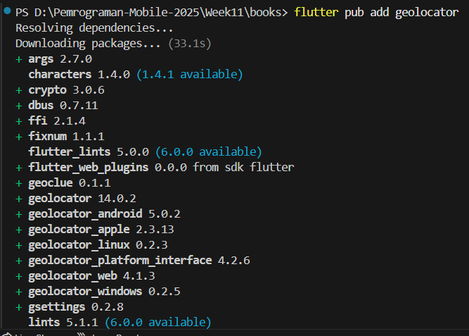

- Langkah 2 - Tambah permission GPS

    ```dart
    <uses-permission android:name="android.permission.ACCESS_FINE_LOCATION"/>
    <uses-permission android:name="android.permission.ACCESS_COARSE_LOCATION"/>
    ```

- Langkah 3 - Buat file geolocation.dart
- Langkah 4 - Buat StatefulWidget
- Langkah 5 - Isi kode geolocation.dart

    ```dart
    import 'package:flutter/material.dart';
    import 'package:geolocator/geolocator.dart';

    class LocationScreen extends StatefulWidget {
    const LocationScreen({super.key});

    @override
    State<LocationScreen> createState() => _LocationScreenState();
    }

    class _LocationScreenState extends State<LocationScreen> {
    String myPosition = '';
    @override
    void initState() {
        super.initState();
        getPosition().then((Position myPos) {
        myPosition = 
            'Latitude: ${myPos.latitude.toString()}, Longitude: ${myPos.longitude.toString()}';
            setState(() {
            myPosition = myPosition;
            });
        });
    }

    @override
    Widget build(BuildContext context) {
        return Scaffold(
        appBar: AppBar(title: const Text('Geolocation Example')),
            body: Center(child: Text(myPosition)),
        );
    }
    Future<Position> getPosition() async {
        await Geolocator.requestPermission();
        await Geolocator.isLocationServiceEnabled();
        Position? position = 
        await Geolocator.getCurrentPosition();
        return position;
    }
    }
    ```

  - **Soal 11**
  
    Tambahkan nama panggilan pada tiap properti title

    ```dart
    appBar: AppBar(title: const Text('Geolocation Example Rafa')),
    ```

- Langkah 6 - Edit main.dart

    ```dart
    home: LocationScreen(),
    ```

- Langkah 7 - Run

    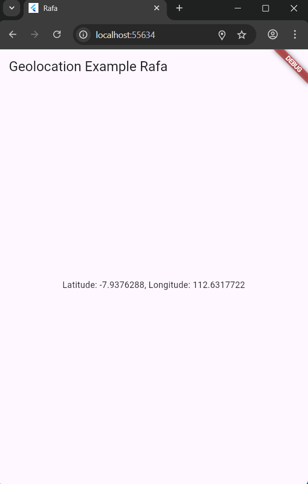

- Langkah 8 - Tambahkan animasi loading

    ```dart
      @override
        Widget build(BuildContext context) {
            final myWidget = myPosition == ''
            ? const CircularProgressIndicator()
            : Text(myPosition);

            return Scaffold(
            appBar: AppBar(title: const Text('Geolocation Example Rafa')),
                body: Center(child: myWidget),
            );
      }
    ```

  - **Soal 12**
    - Apakah Anda mendapatkan koordinat GPS ketika run di browser? Mengapa demikian?
  
        Ya, melihat. Karena kode Flutter memanggil Geolocator.getCurrentPosition(), di web versi plugin geolocator otomatis meneruskan permintaan itu ke Geolocation API milik browser.

    - Capture hasil 
  
        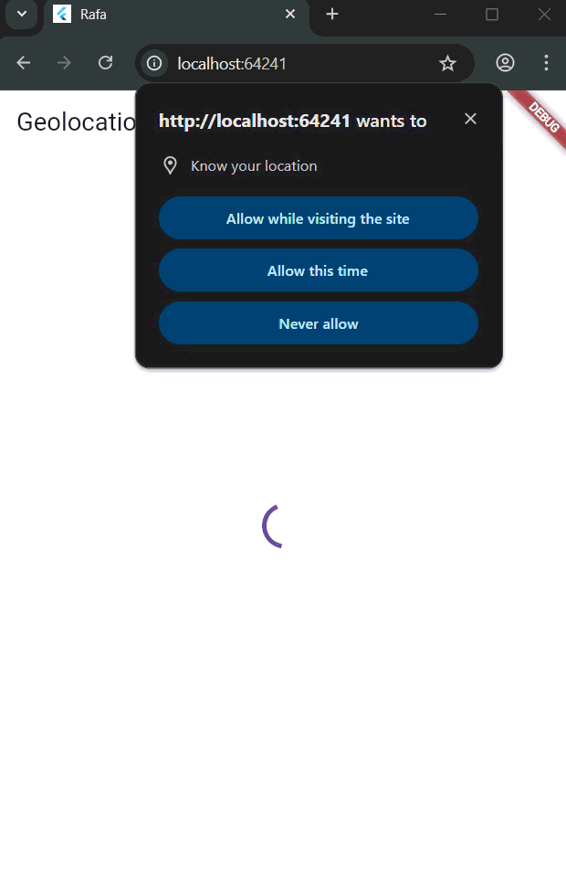

## Praktikum 7 - Manajemen Future dengan FutureBuilder

### Langkah-langkah praktikum 

- Langkah 1 - Modifikasi method getPosition()

    ```dart
    await Future.delayed(const Duration(seconds: 3));
    ```

- Langkah 2 - Tambah variabel

    ```dart
    Future<Position>? position;
    ```

- Langkah 3 - Tambah initState()

    ```dart
    @override
    void initState() {
        super.initState();
        position = getPosition();
    }
    ```

- Langkah 4 - Edit method build()

    ```dart
      @override
        Widget build(BuildContext context) {
            return Scaffold(
            appBar: AppBar(title: Text('Current Location Rafa')),
            body: Center(child: FutureBuilder(
            future: position,
            builder: (BuildContext context, AsyncSnapshot<Position> snapshot) {
                if (snapshot.connectionState == ConnectionState.waiting) {
                return const CircularProgressIndicator();
                }
                else if (snapshot.connectionState ==
                ConnectionState.done) {
                return Text(snapshot.data.toString());
                }
                else {
                return const Text('');
                }
            },
            ),
            ));
        }
    ```

  - **Soal 13**
    - Apakah ada perbedaan UI dengan praktikum sebelumnya? Mengapa demikian?
  
        UI pada praktikum ini berbeda dari sebelumnya karena menggunakan FutureBuilder untuk menampilkan data lokasi secara asinkron. Tampilan awal menunjukkan indikator loading, kemudian berubah menampilkan data posisi setelah proses pengambilan lokasi selesai.

    - Capture hasil

        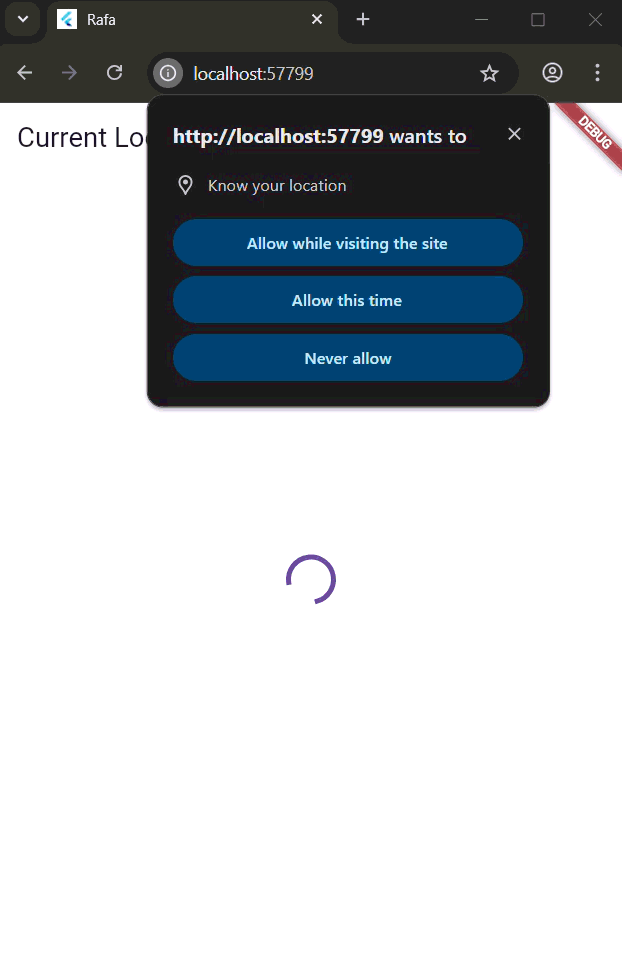
  
- Langkah 5 - Tambah handling error

    ```dart
    if (snapshot.hasError) {
        return Text('Something terrible happened!');
    }
    ```

  - **Soal 14**
    - Apakah ada perbedaan UI dengan langkah sebelumnya? Mengapa demikian?
  
        Adanya penambahan kode untuk handling error yang berfungsi untuk menangani jika terjadi error. Misalnya, jika izin tidak diberikan atau terjadi error maka akan menampilkan pesan di layar. 

    - Capture hasil

        

