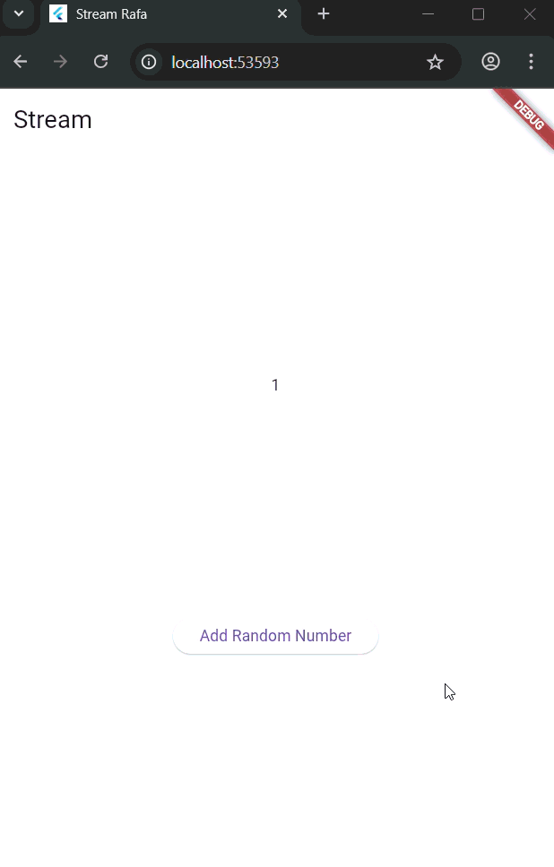
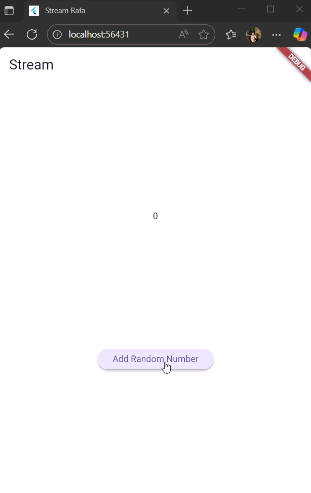
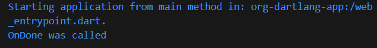
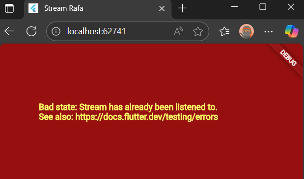
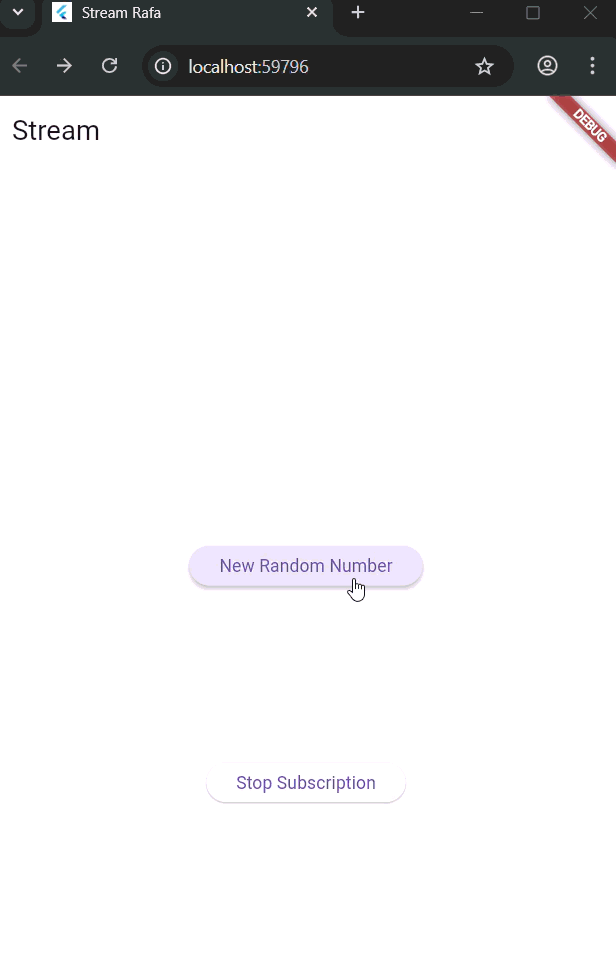
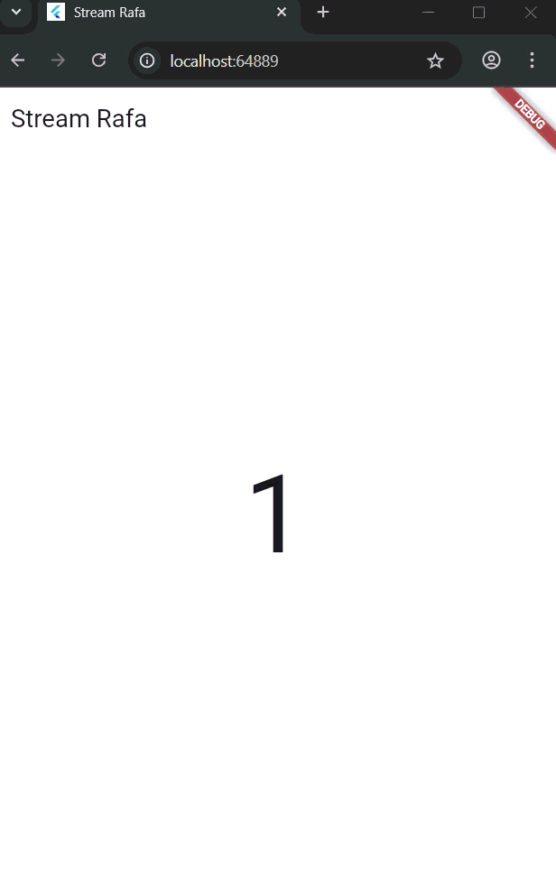

# Pemrograman Mobile - Pertemuan 12 (State Management dengan Streams)

**Nama : Rafa Fadil Aras**

**NIM  : 2341720007**

## Praktikum 1 - Dart Streams

### Langkah-langkah praktikum 

- Langkah 1 - Buat project baru
- Langkah 2 - Buka file main.dart
  ```dart
    import 'package:flutter/material.dart';

    void main() {
    runApp(const MyApp());
    }

    class MyApp extends StatelessWidget {
    const MyApp({super.key});

    @override
    Widget build(BuildContext context) {
        return MaterialApp(
        title: 'Stream Rafa',
        theme: ThemeData(
            primarySwatch: Colors.lightBlue,
        ),
        home: const StreamHomePage(),
        );
    }
    }

    class StreamHomePage extends StatefulWidget {
    const StreamHomePage({super.key});

    @override
    State<StreamHomePage> createState() => _StreamHomePageState();
    }

    class _StreamHomePageState extends State<StreamHomePage> {
    @override
    Widget build(BuildContext context) {
        return Container();
    }
    }
  ```
  - **Soal 1**
    - Menambahkan nama panggilan 
        ```dart
        title: 'Stream Rafa',
        ```
    - Ganti warna tema aplikasi
        ```dart
        primarySwatch: Colors.lightBlue,
        ```
- Langkah 3 - Buat file baru stream.dart
  ```dart
  import 'package:flutter/material.dart';

    class ColorStream {
    
    }
  ```
- Langkah 4 - Tambah variabel colors
  ```dart
    final List<Color> _colors = [
    Colors.blueGrey,
    Colors.amber,
    Colors.deepPurple,
    Colors.lightBlue,
    Colors.teal
  ];
  ```
  - **Soal 2**

    Menambahkan 5 warna pada variabel colors
    ```dart
    Colors.pink,
    Colors.brown,
    Colors.cyan,
    Colors.orangeAccent,
    Colors.lime
    ```
- Langkah 5 - Tambah method getColors()
  ```dart
    Stream<Color> getColors() async* {
    
  }
  ```
- Langkah 6 - Tambah perintah yield*
  ```dart
    Stream<Color> getColors() async* {
        yield* Stream.periodic(const Duration(seconds: 1), (int t) {
        int index = t % _colors.length;
        return _colors[index];
        });
    }
  ```
  - **Soal 3**
    - Jelaskan fungsi keyword yield*!

      Keyword yield digunakan dalam fungsi generator di Dart untuk menghasilkan data secara bertahap. Saat dijalankan, yield akan mengeluarkan satu nilai tanpa menghentikan fungsi sepenuhnya, sehingga fungsi dapat dilanjutkan kembali pada pemanggilan berikutnya. Pada fungsi bertipe async*, yield menghasilkan aliran data berbentuk Stream, sedangkan pada sync* menghasilkan Iterable. Dengan cara ini, data dapat dikirim satu per satu secara efisien tanpa harus disimpan semua sekaligus di memori.

    - Apa maksud isi perintah kode tersebut?

      Perintah kode tersebut untuk membuat aliran data yang mengeluarkan warna berbeda setiap detik secara berulang.

- Langkah 7 - Impor file pada main.dart
  ```dart
  import 'stream.dart';
  ```
- Langkah 8 - Tambah variabel
  ```dart
  Color bgColor = Colors.blueGrey;
  late ColorStream colorStream;
  ```
- Langkah 9 - Tambah method changeColor()
  ```dart
    void changeColor() async {
      await for (var eventColor in colorStream.getColors()) {
        setState(() {
          bgColor = eventColor;
        });
      }
    }
  ```
- Langkah 10 - Lakukan override initState()
  ```dart
    @override
    void initState() {
      super.initState();
      colorStream = ColorStream();
      changeColor();
    }
  ```
- Langkah 11 - Ubah isi Scaffold()
  ```dart
  @override
  Widget build(BuildContext context) {
    return Scaffold(
      appBar: AppBar(
        title: const Text('Stream'),
      ),
      body: Container(
        decoration: BoxDecoration(color: bgColor),
      ),
    );
  }
  ```
- Langkah 12 - Run
  - **Soal 4**

    Capture Hasil 

    


- Langkah 13 - Ganti isi method changeColor()
  ```dart
      ColorStream().getColors().listen((eventColor) {
      setState(() {
        bgColor = eventColor;
      });
    });
  ```
  - Soal 5 

    Jelaskan perbedaan menggunakan listen dan await for!

    Metode listen digunakan untuk mendaftarkan callback yang akan dijalankan setiap kali stream mengirim data baru, sehingga cocok digunakan tanpa perlu menghentikan eksekusi program utama. Sementara itu, await for digunakan di dalam fungsi asinkron untuk menunggu setiap data dari stream secara berurutan, seperti melakukan perulangan yang menunggu setiap elemen sebelum melanjutkan ke berikutnya.

## Praktikum 2 - Stream controllers dan sinks

### Langkah-langkah praktikum 

- Langkah 1 - Buka file stream.dart
  ```dart
  import 'dart:async';
  ```
- Langkah 2 - Tambah class NumberStream
  ```dart
  class NumberStream {
  
  }
  ```
- Langkah 3 - Tambah StreamController
  ```dart
  final StreamController<int> controller = StreamController<int>();
  ```
- Langkah 4 - Tambah method addNumberToSink
  ```dart
    void addNumberToSink(int number) {
    controller.sink.add(number);
  }
  ```
- Langkah 5 - Tambah method close()
  ```dart
    close() {
    controller.close();
  }
  ```
- Langkah 6 - Import kode pada main.dart
  ```dart
  import "dart:async";
  import 'dart:math';
  ```
- Langkah 7 - Tambah variabel
  ```dart
  int lastNumber = 0;
  late StreamController numberStreamController;
  late NumberStream numberStream;
  ```
- Langkah 8 - Edit initState()
  ```dart
    numberStream = NumberStream();
    numberStreamController = numberStream.controller;
    Stream stream = numberStreamController.stream;
    stream.listen((event) {
      setState(() {
        lastNumber = event;
      });
    });
    super.initState();
  ```
- Langkah 9 - Edit dispose()
  ```dart
    @override
    void dispose() {
      numberStreamController.close(); 
      super.dispose(); 
    }
  ```
- Langkah 10 - Tambah method addRandomNumber()
  ```dart
    void addRandomNumber() {
    Random random = Random();
    int myNum = random.nextInt(10);
    numberStream.addNumberToSink(myNum);
  }
  ```
- Langkah 11 - Edit method build()
  ```dart
  @override
  Widget build(BuildContext context) {
    return Scaffold(
      appBar: AppBar(title: const Text('Stream')),
      body:SizedBox(
        width: double.infinity,
        child: Column(
          mainAxisAlignment: MainAxisAlignment.spaceEvenly,
          crossAxisAlignment: CrossAxisAlignment.center,
          children: [
            Text(lastNumber.toString()),
            ElevatedButton(
              onPressed: addRandomNumber,
              child: const Text('Add Random Number'),
            ),
          ],
        ),
      ),
    );
  }
  ```
- Langkah 12 - Run
  - **Soal 6**
    - Jelaskan maksud kode langkah 8 dan 10!

      Pada langkah 8, kode pada initState() digunakan untuk menginisialisasi stream yang akan memantau perubahan data secara real-time. Objek NumberStream dibuat dan dikaitkan dengan StreamController, lalu fungsi listen() digunakan untuk mendengarkan setiap data baru yang masuk ke stream. Setiap kali ada nilai baru dikirim, fungsi setState() dipanggil agar tampilan diperbarui dengan nilai lastNumber terbaru.

      Sedangkan pada langkah 10, metode addRandomNumber() berfungsi untuk menghasilkan angka acak menggunakan kelas Random dan kemudian mengirimkan angka tersebut ke stream melalui addNumberToSink(). Dengan cara ini, setiap angka acak yang dihasilkan akan otomatis dikirim ke stream dan memicu pembaruan tampilan di aplikasi.

    - Capture hasil 

      

- Langkah 13 - Tambah method addError()
  ```dart
    addError() {
    controller.sink.addError('error');
  }
  ```
- Langkah 14 - Tambah method onError
  ```dart
    }).onError((error) {
      setState(() {
        lastNumber = -1;
      });
    });
  ```
- Langkah 15 - Edit method addRandomNumber()
  ```dart
    numberStream.addError();
  ```
  - **Soal 7**
    
    Jelaskan maksud kode langkah 13 - 15!

    Pada langkah 13, method addError() ditambahkan di dalam stream.dart untuk mengirimkan data kesalahan (error) ke aliran stream menggunakan controller.sink.addError('error'). Pada langkah 14 menambahkan penanganan error pada main.dart dengan menambahkan method onError di dalam fungsi listen, sehingga jika stream mengirimkan error, aplikasi akan menampilkan nilai lastNumber = -1 sebagai tanda terjadi kesalahan. Sedangkan pada langkah 15, method addRandomNumber() diperbarui dengan mengomentari kode pengiriman angka acak dan menggantinya dengan pemanggilan numberStream.addError(), agar dapat menguji bagaimana aplikasi menangani kondisi error yang dikirim dari stream.

    .gif)

## Praktikum 3 - Injeksi data ke streams

### Langkah-langkah praktikum 

- Langkah 1 - Tambah variabel baru di class _StreamHomePageState
  ```dart
  late StreamTransformer transformer;
  ```
- Langkah 2 - Tambahkan kode ini di initState
  ```dart
      transformer = StreamTransformer<int, int>.fromHandlers(
      handleData: (value, sink) {
        sink.add(value * 10);
      },
      handleError: (error, trace, sink) {
        sink.add(-1);
      },
      handleDone: (sink) => sink.close());
  ```
- Langkah 3 - Tetap di initState
  ```dart
      stream
        .transform(transformer)
        .listen((event) {
          setState(() {
            lastNumber = event;
          });
        })
        .onError((error) {
          setState(() {
            lastNumber = -1;
          });
        });

    super.initState();
  ```
- Langkah 4 - Run
  - **Soal 8**
    - Jelaskan maksud kode langkah 1-3!

      Pada langkah 1, variabel transformer ditambahkan di dalam kelas _StreamHomePageState untuk menampung objek StreamTransformer, yaitu komponen yang digunakan untuk memproses data sebelum dikirim ke pendengar (listener). Pada langkah 2, objek transformer diinisialisasi di dalam initState() menggunakan StreamTransformer.fromHandlers, yang berfungsi mengubah setiap data yang masuk menjadi hasil kali sepuluh, serta mengirim nilai -1 jika terjadi error. Kemudian pada langkah 3, stream diubah agar melewati proses transformasi tersebut dengan menambahkan .transform(transformer) sebelum .listen(), sehingga setiap data yang diterima di listen sudah melalui proses pengolahan atau penanganan error sesuai yang didefinisikan di transformer.

    - Capture hasil 

        


## Praktikum 4 - Subscribe ke stream events

### Langkah-langkah praktikum 

- Langkah 1 - Tambah variabel baru di class _StreamHomePageState
  ```dart
  late StreamSubscription subscription;
  ```
- Langkah 2 - Edit initState()
  ```dart
      subscription = stream.listen((event) {
      setState(() {
        lastNumber = event;
      });
    });
  ```
- Langkah 3 - Tambahkan kode di initState()
  ```dart
      subscription.onError((error) {
      setState(() {
        lastNumber = -1;
      });
    });
  ```
- Langkah 4 - Tambah properti onDone()
  ```dart
      subscription.onDone(() {
      print('OnDone was called');
    });
  ```
- Langkah 5 - Tambah method baru
  ```dart
    void stopStream() {
    numberStreamController.close();
  }
  ```
- Langkah 6 - Pindah ke method dispose()
  ```dart
  subscription.cancel();
  ```
- Langkah 7 - Pindah ke method build()
  ```dart
  ElevatedButton(
    onPressed: () => stopStream(),
    child: const Text('Stop Subscription'),
  ),
  ```
- Langkah 8 - Edit method addRandomNumber()
  ```dart
      if (!numberStreamController.isClosed) {
      numberStream.addNumberToSink(myNum);
    } else {
      setState(() {
        lastNumber = -1;
      });
    }
  ```
- Langkah 9 - Run
- Langkah 10 - Tekan button 'Stop Subscription'
  
  - **Soal 9**
    - Jelaskan maksud kode langkah 2,6 dan 8!
      
      Pada langkah 2, kode dalam initState() berfungsi untuk memulai proses listen aliran data dari stream. Setiap kali ada data baru yang dikirim ke stream, nilai tersebut disimpan ke variabel lastNumber melalui setState(), sehingga tampilan aplikasi akan otomatis diperbarui sesuai data terbaru. Pada langkah 6, kode subscription.cancel() di dalam dispose() digunakan untuk menghentikan proses mendengarkan stream ketika widget dihapus dari tampilan, agar tidak terjadi kebocoran memori. Sedangkan pada langkah 8, bagian kode di addRandomNumber() memastikan bahwa data baru hanya dikirim ke stream jika numberStreamController masih terbuka. Jika sudah ditutup, maka nilai lastNumber diubah menjadi -1 sebagai penanda bahwa stream sudah tidak aktif lagi.

    - Capture hasil 

        

## Praktikum 5 - Multiple stream subscriptions

### Langkah-langkah praktikum 

- Langkah 1 - Tambah variabel baru di class _StreamHomePageState
  ```dart
  late StreamSubscription subscription2;
  String values = '';
  ```
- Langkah 2 - Edit initState()
  ```dart
      Stream stream = numberStreamController.stream;
    subscription = stream.listen((event) {
      setState(() {
        values += '$event - ';
      });
    });

    subscription2 = stream.listen((event) {
      setState(() {
        values += '$event - ';
      });
    });
  ```
- Langkah 3 - Run
  
  - **Soal 10**

    Jelaskan mengapa error itu terjadi!

    Error tersebut terjadi karena ada dua listener (subscription dan subscription2) yang mencoba mendengarkan stream yang sama, yaitu numberStreamController.stream.
    Namun, stream standar di Dart bersifat single-subscription, sehingga hanya satu listener yang boleh aktif. Saat listener kedua mencoba mendengarkan stream yang sudah punya listener pertama, Flutter langsung menampilkan error tersebut.

- Langkah 4 - Set broadcast stream
  ```dart
  Stream stream = numberStreamController.stream.asBroadcastStream();
  ```
- Langkah 5 - Edit method build()
  ```dart
  Text(values),
  ```
- Langkah 6 - Run
  - **Soal 11**
    - Jelaskan mengapa hal itu bisa terjadi!

      karena pada kode di initState(), dibuat dua listener (subscription dan subscription2) yang keduanya mendengarkan stream yang sama. Setelah stream diubah menjadi broadcast stream, satu stream bisa diakses oleh banyak listener sekaligus tanpa error.

    - Capture hasil 
  
      


## Praktikum 6 - StreamBuilder

### Langkah-langkah praktikum 

- Langkah 1 - Buat project baru
- Langkah 2 - Buat file baru stream.dart
  ```dart
  class NumberStream {}
  ```
- Langkah 3 - Tetap di file stream.dart
  ```dart
  import 'dart:math';

  class NumberStream {
    Stream<int> getNumbers() async* {
      yield* Stream.periodic(const Duration(seconds: 1), (int t) {
        Random random = Random();
        int myNum = random.nextInt(10);
        return myNum;
      });
    }
  }
  ```
- Langkah 4 - Edit main.dart
  ```dart
  import 'package:flutter/material.dart';
  import 'stream.dart';
  import 'dart:async';

  void main() {
    runApp(const MyApp());
  }

  class MyApp extends StatelessWidget {
    const MyApp({super.key});

    @override
    Widget build(BuildContext context) {
      return MaterialApp(
        title: 'Stream Rafa',
        theme: ThemeData(
          primarySwatch: Colors.deepPurple,
        ),
        home: const StreamHomePage(),
      );
    }
  }

  class StreamHomePage extends StatefulWidget {
    const StreamHomePage({super.key});

    @override
    State<StreamHomePage> createState() => _StreamHomePageState();
  }

  class _StreamHomePageState extends State<StreamHomePage> {
    @override
    Widget build(BuildContext context) {
      return Scaffold(
        appBar: AppBar(
          title: const Text('Stream Rafa'),
        ),
        body: Container(

        ),
      );
    }
  }
  ```
- Langkah 5 - Tambah variabel
  ```dart
  late Stream<int> numberStream;
  ```
- Langkah 6 - Edit initState()
  ```dart
    @override
    void initState() {
      numberStream = NumberStream().getNumbers();
      super.initState();
    }
  ```
- Langkah 7 - Edit method build()
  ```dart
  body: StreamBuilder(
        stream: numberStream,
        initialData: 0,
        builder: (context, snapshot) {
          if (snapshot.hasError) {
            print('Error!');
          }
          if (snapshot.hasData) {
            return Center(
              child: Text(
                snapshot.data.toString(),
                style: const TextStyle(fontSize: 96),
              ),
            );
          } else {
            return const SizedBox.shrink();
          }
        }
      ),
  ```
- Langkah 8 - Run
  - **Soal 12**
    - Jelaskan maksud kode pada langkah 3 dan 7!

      Pada langkah 3, membuat sebuah kelas bernama NumberStream yang menghasilkan aliran data berupa angka acak setiap satu detik menggunakan Stream.periodic. Setiap kali stream berjalan, fungsi ini memanggil Random() untuk menghasilkan angka acak antara 0 hingga 9, lalu mengirimkannya (yield) ke stream secara berulang.

      Sedangkan pada langkah 7, kode di build() menggunakan StreamBuilder untuk menampilkan data dari stream tersebut secara real-time di layar. Setiap kali stream mengirim angka baru, StreamBuilder otomatis membangun ulang tampilan (rebuild) dan memperbarui teks di tengah layar dengan nilai terbaru. Jika ada error pada stream, maka akan dicetak pesan “Error!”.

    - Capture hasil 

        

