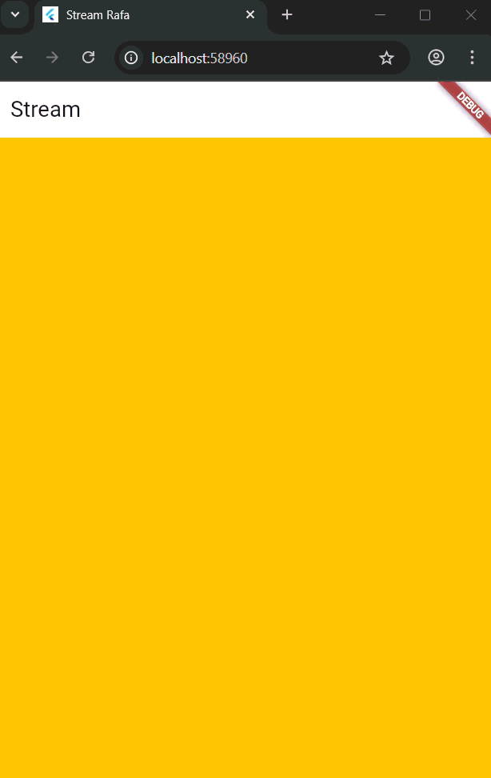

# Pemrograman Mobile - Pertemuan 12 (State Management dengan Streams)

**Nama : Rafa Fadil Aras**

**NIM  : 2341720007**

## Praktikum 1 - Dart Streams

### Langkah-langkah praktikum 

- Langkah 1 - Buat project baru
- Langkah 2 - Buka file main.dart
  ```dart
    import 'package:flutter/material.dart';

    void main() {
    runApp(const MyApp());
    }

    class MyApp extends StatelessWidget {
    const MyApp({super.key});

    @override
    Widget build(BuildContext context) {
        return MaterialApp(
        title: 'Stream Rafa',
        theme: ThemeData(
            primarySwatch: Colors.lightBlue,
        ),
        home: const StreamHomePage(),
        );
    }
    }

    class StreamHomePage extends StatefulWidget {
    const StreamHomePage({super.key});

    @override
    State<StreamHomePage> createState() => _StreamHomePageState();
    }

    class _StreamHomePageState extends State<StreamHomePage> {
    @override
    Widget build(BuildContext context) {
        return Container();
    }
    }
  ```
  - **Soal 1**
    - Menambahkan nama panggilan 
        ```dart
        title: 'Stream Rafa',
        ```
    - Ganti warna tema aplikasi
        ```dart
        primarySwatch: Colors.lightBlue,
        ```
- Langkah 3 - Buat file baru stream.dart
  ```dart
  import 'package:flutter/material.dart';

    class ColorStream {
    
    }
  ```
- Langkah 4 - Tambah variabel colors
  ```dart
    final List<Color> _colors = [
    Colors.blueGrey,
    Colors.amber,
    Colors.deepPurple,
    Colors.lightBlue,
    Colors.teal
  ];
  ```
  - **Soal 2**

    Menambahkan 5 warna pada variabel colors
    ```dart
    Colors.pink,
    Colors.brown,
    Colors.cyan,
    Colors.orangeAccent,
    Colors.lime
    ```
- Langkah 5 - Tambah method getColors()
  ```dart
    Stream<Color> getColors() async* {
    
  }
  ```
- Langkah 6 - Tambah perintah yield*
  ```dart
    Stream<Color> getColors() async* {
        yield* Stream.periodic(const Duration(seconds: 1), (int t) {
        int index = t % _colors.length;
        return _colors[index];
        });
    }
  ```
  - **Soal 3**
    - Jelaskan fungsi keyword yield*!

      Keyword yield digunakan dalam fungsi generator di Dart untuk menghasilkan data secara bertahap. Saat dijalankan, yield akan mengeluarkan satu nilai tanpa menghentikan fungsi sepenuhnya, sehingga fungsi dapat dilanjutkan kembali pada pemanggilan berikutnya. Pada fungsi bertipe async*, yield menghasilkan aliran data berbentuk Stream, sedangkan pada sync* menghasilkan Iterable. Dengan cara ini, data dapat dikirim satu per satu secara efisien tanpa harus disimpan semua sekaligus di memori.

    - Apa maksud isi perintah kode tersebut?

      Perintah kode tersebut untuk membuat aliran data yang mengeluarkan warna berbeda setiap detik secara berulang.

- Langkah 7 - Impor file pada main.dart
  ```dart
  import 'stream.dart';
  ```
- Langkah 8 - Tambah variabel
  ```dart
  Color bgColor = Colors.blueGrey;
  late ColorStream colorStream;
  ```
- Langkah 9 - Tambah method changeColor()
  ```dart
    void changeColor() async {
      await for (var eventColor in colorStream.getColors()) {
        setState(() {
          bgColor = eventColor;
        });
      }
    }
  ```
- Langkah 10 - Lakukan override initState()
  ```dart
    @override
    void initState() {
      super.initState();
      colorStream = ColorStream();
      changeColor();
    }
  ```
- Langkah 11 - Ubah isi Scaffold()
  ```dart
  @override
  Widget build(BuildContext context) {
    return Scaffold(
      appBar: AppBar(
        title: const Text('Stream'),
      ),
      body: Container(
        decoration: BoxDecoration(color: bgColor),
      ),
    );
  }
  ```
- Langkah 12 - Run
  - **Soal 4**

    Capture Hasil 

    