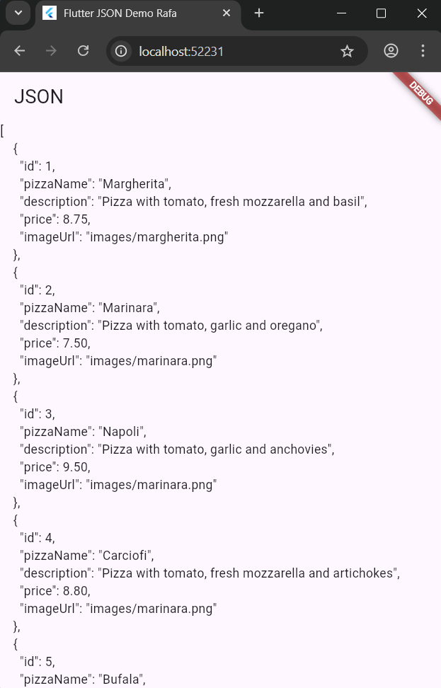
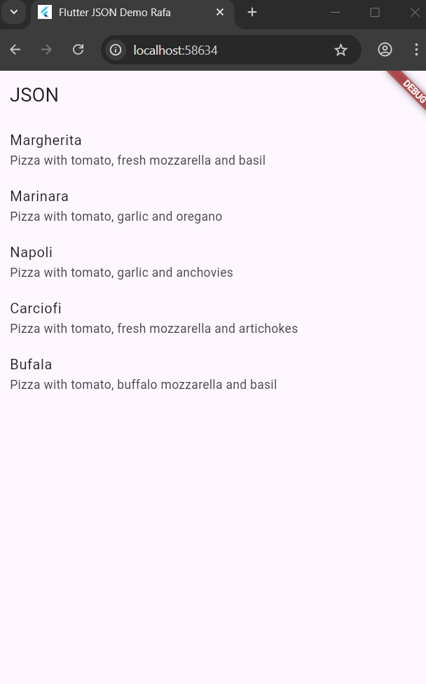
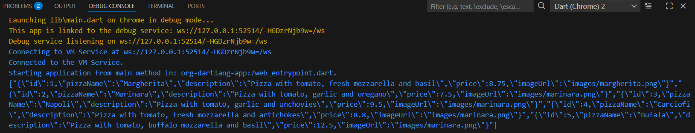
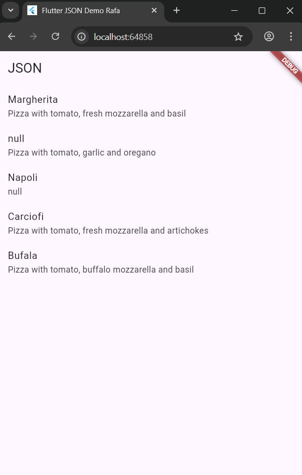
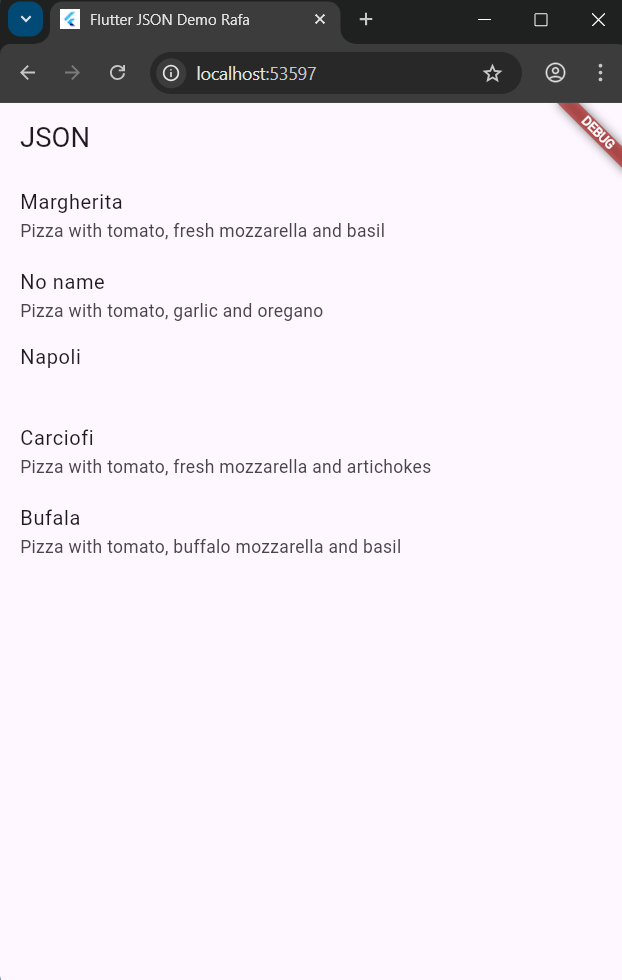
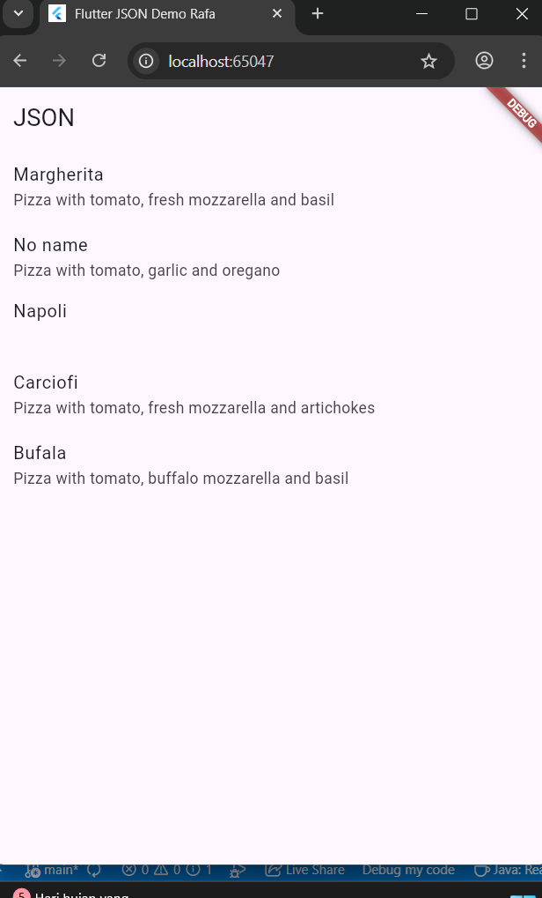
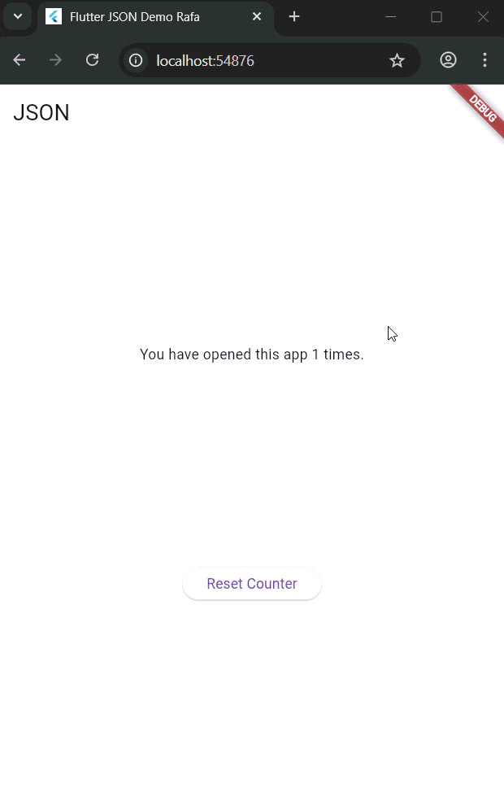
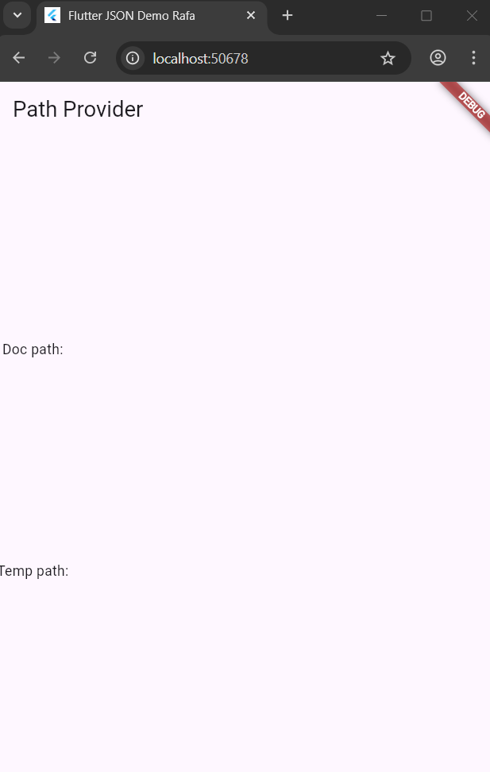
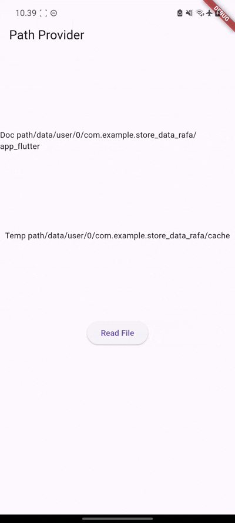

# Pemrograman Mobile - Pertemuan 13 (Persistensi Data)

**Nama : Rafa Fadil Aras**

**NIM  : 2341720007**

## Praktikum 1 - Konversi Dart model ke JSON

### Langkah-langkah praktikum 

- Langkah 1 - Buat project baru
- Langkah 2 - Buka file main.dart
  ```dart
  import 'package:flutter/material.dart';

  void main() {
    runApp(const MyApp());
  }

  class MyApp extends StatelessWidget {
    const MyApp({super.key}); 

    @override
    Widget build(BuildContext context) {
      return MaterialApp(
        title: 'Flutter JSON Demo Rafa',
        theme: ThemeData(
          primarySwatch: Colors.pink,
        ),
        home: const MyHomePage(),
      );
    }
  }

  class MyHomePage extends StatefulWidget {
    const MyHomePage({super.key});

    @override
    State<MyHomePage> createState() => _MyHomePageState();
  }

  class _MyHomePageState extends State<MyHomePage> {
    @override
    Widget build(BuildContext context) {
      return Scaffold(
        appBar: AppBar(title: const Text('JSON')),
        body: Container(),
      );
    }
  }
  ```
  - **Soal 1**
    - Menambahkan nama panggilan
      ```dart
      title: 'Flutter JSON Demo Rafa',
      ```
    - Mengganti warna
      ```dart
      primarySwatch: Colors.pink,
      ```
- Langkah 3 - Buat folder baru assets
- Langkah 4 - Buat file baru pizzalist.json
  ```dart
  [ 
    { 
      "id": 1, 
      "pizzaName": "Margherita", 
      "description": "Pizza with tomato, fresh mozzarella and basil",
      "price": 8.75, 
      "imageUrl": "images/margherita.png" 
    }, 
    { 
      "id": 2, 
      "pizzaName": "Marinara", 
      "description": "Pizza with tomato, garlic and oregano",
      "price": 7.50, 
      "imageUrl": "images/marinara.png"  
    }, 
    { 
      "id": 3, 
      "pizzaName": "Napoli", 
      "description": "Pizza with tomato, garlic and anchovies",
      "price": 9.50, 
      "imageUrl": "images/marinara.png"  
    }, 
    { 
      "id": 4, 
      "pizzaName": "Carciofi", 
      "description": "Pizza with tomato, fresh mozzarella and artichokes",
      "price": 8.80, 
      "imageUrl": "images/marinara.png"  
    }, 
    { 
      "id": 5, 
      "pizzaName": "Bufala", 
      "description": "Pizza with tomato, buffalo mozzarella and basil",
      "price": 12.50, 
      "imageUrl": "images/marinara.png"  
    }
  ]
  ```
- Langkah 5 - Edit pubspec.yaml
  ```dart
    assets:
    - assets/
  ```
- Langkah 6 - Edit maint.dart
  ```dart
  String pizzaString = '';
  ```
- Langkah 7 - Tetap di main.dart
  ```dart
  Future readJsonFile() async {
    String myString = await DefaultAssetBundle.of(context)
    .loadString('assets/pizzalist.json');
    setState(() {
      pizzaString = myString;
    });
  }
  ```
- Langkah 8 - Panggil method readJsonFile
  ```dart
  @override
  void initState() {
    super.initState();
    readJsonFile(); 
  }
  ```
- Langkah 9 - Tampilkan hasil JSON
  ```dart
  body: Text(pizzaString),
  ```
- Langkah 10 - Run
  - **Soal 2**
    - Hasil 
  
        
        
- Langkah 11 - Buat file baru pizza.dart
- Langkah 12 - Model pizza.dart
  ```dart
  class Pizza {
    final int id;
    final String pizzaName;
    final String description;
    final double price;
    final String imageUrl;
  }
  ```
- Langkah 13 - Buat constructor()
  ```dart
  Pizza.fromJson(Map<String, dynamic> json) : 
    id = json['id'],
    pizzaName = json['pizza_name'],
    description = json['description'],
    price = json['price'].toDouble(),
    imageUrl = json['image_url'];
  ```
- Langkah 14 - Pindah ke class _MyHomePageState
  ```dart
  Future readJsonFile() async {
    String myString = await DefaultAssetBundle.of(context)
    .loadString('assets/pizzalist.json');
    List pizzaMapList = jsonDecode(myString);
  }
  ```
- Langkah 15 - Pastikan impor class
  ```dart
  import 'dart:convert';
  import './model/pizza.dart';
  ```
- Langkah 16 - Konversi List Map ke List Objek Dart
  ```dart
  List<Pizza> myPizzas = [];
    for (var pizza in pizzaMapList) {
      Pizza myPizza = Pizza.fromJson(pizza);
      myPizzas.add(myPizza);
  }
  ```
- Langkah 17 - return myPizzas
  ```dart
  return myPizzas;
  ```
- Langkah 18 - Perbarui Signature Method
  ```dart
  Future<List<Pizza>>readJsonFile() async {
  ```
- Langkah 19 - Deklarasikan Variabel State
  ```dart
  List<Pizza> myPizzas = [];
  ```
- Langkah 20 - Panggil di initState dan Perbarui State
  ```dart
  readJsonFile().then((value) {
    setState(() {
      myPizzas = value;
    });
  }); 
  ```
- Langkah 21 - Tampilkan Data di ListView
  ```dart
  body: ListView.builder(
    itemCount: myPizzas.length,
    itemBuilder: (context, index) {
      return ListTile(
        title: Text(myPizzas[index].pizzaName),
        subtitle: Text(myPizzas[index].description),
  );;
  ```
- Langkah 22 - Run
  - **Soal 3**
    - Hasil 
  
        

- Langkah 23 - Tambahkan Method toJson() (Serialization)
  ```dart
  Map<String, dynamic> toJson() {
    return {
      'id': id,
      'pizzaName': pizzaName,
      'description': description,
      'price': price,
      'imageUrl': imageUrl,
    };
  }
  ```
- Langkah 24 - Buat Fungsi Konversi JSON String
  ```dart
  String convertToJSON(List<Pizza> pizzas) {
    return jsonEncode(pizzas.map((pizza) => jsonEncode(pizza)).toList());
  }
  ```
- Langkah 25 - Tampilkan Output JSON di Konsol
  ```dart
    String convertToJSON(List<Pizza> pizzas) {
    return jsonEncode(pizzas.map((pizza) => jsonEncode(pizza)).toList());
  }
  ```
- Langkah 26 - Cek Output Konsol
  

## Praktikum 2 - Handle kompatibilitas data JSON

### Langkah-langkah praktikum 

- Langkah 1 - Simulasikan Error
- Langkah 2 - Lihat Error Tipe Data String ke Int
- Langkah 3 - Terapkan tryParse dan Null Coalescing pada ID
  ```dart
  id = int.tryParse(json['id'].toString()) ?? 0,
  ```
- Langkah 4 - Simulasikan Error Null pada String
- Langkah 5 - Terapkan Null Coalescing pada String
  ```dart
  imageUrl = json['imageUrl'] ?? '';
  ```
- Langkah 6 - Gunakan toString() untuk Field String
  ```dart
  pizzaName = json['pizzaName'].toString(),
  description = json['description'].toString(),
  ```
- Langkah 7 - Simulasikan Error Tipe Data String ke Double
- Langkah 8 - Terapkan double.tryParse
  ```dart
  price = double.tryParse(json['price'].toString()) ?? 0,
  ```
- Langkah 9 - Run dan Perhatikan Output Null
  
  

- Langkah 10 - Tambahkan Operator Ternary untuk Output User-Friendly
  ```dart
    pizzaName = json['pizzaName'] != null ? json['pizzaName'].toString() : 'No name',
    description = (json['description'] != null) ? json['description'].toString() : '',
  ```
- Langkah 11 - Run
  - **Soal 4**
    - Hasil 
  
        

## Praktikum 3 - Menangani error JSON

### Langkah-langkah praktikum 

- Langkah 1 - Buka pizza.dart dan Buat Konstanta
  ```dart
  const keyId = 'id';
  const keyName = 'pizzaName';
  const keyDescription = 'description';
  const keyPrice = 'price';
  const keyImage = 'imageUrl';
  ```
- Langkah 2 - Perbarui fromJson() menggunakan Konstanta
  ```dart
    Pizza.fromJson(Map<String, dynamic> json) : 
    id = int.tryParse(json[keyId].toString()) ?? 0,
    pizzaName = json[keyName] != null ? json[keyName].toString() : 'No name',
    description = (json[keyDescription] != null) ? json[keyDescription].toString() : '',
    price = double.tryParse(json[keyPrice].toString()) ?? 0,
    imageUrl = json[keyImage] ?? '';
  ```
- Langkah 3 - Perbarui toJson() menggunakan Konstanta
  ```dart
    Map<String, dynamic> toJson() {
    return {
      keyId: id,
      keyName: pizzaName,
      keyDescription: description,
      keyPrice: price,
      keyImage: imageUrl,
    };
  }
  ```
- Langkah 4 - Run
  - **Soal 5**
    - Jelaskan maksud kode lebih safe dan maintainable
    - 
      Kode pada praktikum ini lebih aman karena setiap data dari JSON dicek terlebih dahulu sebelum digunakan. Angka diproses dengan tryPasrse agar aplikasi tidak error jika datanya kosong. FIeld teks dicek null dan diberi nilai cadangan, sehingga UI tetap stabil. Penggunaan konstanta untuk nama key membuat kode lebih mudah untuk maintanance karena jika ada perubahan nama field, cukup diperbarui di satu tempat saja, sehingga hasil kode lebih tahan terhadap data yang tidak konsisten dan mudah dipahami. 
    - Hasil 
  
        

## Praktikum 4 - SharedPreferences

### Langkah-langkah praktikum 

- Langkah 1 - Tambahkan Dependensi
  ```dart
  flutter pub add shared_preferences
  ```
- Langkah 2 - Install Dependensi
  ```dart
  flutter pub get
  ```
- Langkah 3 - Lakukan Import
  ```dart
  import 'package:shared_preferences/shared_preferences.dart';
  ```
- Langkah 4 - Tambahkan Variabel appCounter
  ```dart
  int appCounter = 0;
  ```
- Langkah 5 - Buat Method readAndWritePreference
  ```dart
  Future readAndWritePreference() async {  
  }
  ```
- Langkah 6 - Dapatkan Instance SharedPreferences
  ```dart
  SharedPreferences prefs = await SharedPreferences.getInstance();
  ```
- Langkah 7 - Baca, Cek Null, dan Increment Counter
  ```dart
  appCounter = prefs.getInt('appCounter') ?? 0;
  appCounter++;
  ```
- Langkah 8 - Simpan Nilai Baru
  ```dart
  await prefs.setInt('appCounter', appCounter);
  ```
- Langkah 9 - Perbarui State
  ```dart
    setState(() {
      appCounter = appCounter;
    });
  ```
- Langkah 10 - Panggil di initState()
  ```dart
  readAndWritePreference();
  ```
- Langkah 11 - Perbarui Tampilan (body)
  ```dart
  @override
  Widget build(BuildContext context) {
    return Scaffold(
      appBar: AppBar(title: const Text('JSON')),
      body: Center(
        child: Column(
          mainAxisAlignment: MainAxisAlignment.spaceEvenly,
          children: [
            Text(
              'You have opened this app $appCounter times.',
            ),
            ElevatedButton(
              onPressed: () {},
              child: const Text('Reset Counter'),
            ),
          ],
        ),
      ),
    );
  }
  ```
- Langkah 12 - Run
- Langkah 13 - Buat Method deletePreference()
  ```dart
    Future deletePreference() async {
    SharedPreferences prefs = await SharedPreferences.getInstance();
    await prefs.clear();
    setState(() {
      appCounter = 0;
    });
  }
  ```
- Langkah 14 - Panggil deletePreference()
  ```dart
  deletePreference();
  ```
- Langkah 15 - Run
  - **Soal 6**
    - Hasil 
  
        

## Praktikum 5 - Akses filesystem dengan path_provider

### Langkah-langkah praktikum 

- Langkah 1 - Tambahkan Dependensi
  ```dart
  flutter pub add path_provider
  ```
- Langkah 2 - Lakukan Import
  ```dart
  import 'package:path_provider/path_provider.dart';
  ```
- Langkah 3 - Tambahkan Variabel Path State
  ```dart
  String documentsPath = '';
  String tempPath = '';
  ```
- Langkah 4 - Buat Method getPaths()
  ```dart
  Future getPaths() async {
    final docDir = await getApplicationDocumentsDirectory();
    final tempDir = await getTemporaryDirectory();
      setState(() {
        documentsPath = docDir.path;
        tempPath = tempDir.path;
      });
  }
  ```
- Langkah 5 - Panggil getPaths() di initState()
  ```dart
  getPaths();
  ```
- Langkah 6 - Perbarui Tampilan
  ```dart
  @override
  Widget build(BuildContext context) {
    return Scaffold(
      appBar: AppBar(title: const Text('Path Provider')),
      body: Column(
        mainAxisAlignment: MainAxisAlignment.spaceEvenly,
        children: [
          Text('Doc path: $documentsPath'),
          Text('Temp path: $tempPath'),
        ],
      ),
    );
  }
  ```
- Langkah 7 - Run
  - **Soal 7**
    - Hasil 
  
        

## Praktikum 6 - Akses filesystem dengan direktori

### Langkah-langkah praktikum 

- Langkah 1 - Lakukan Import dart:io
  ```dart
  import 'dart:io';
  ```
- Langkah 2 - Tambahkan Variabel File dan Text
  ```dart
  late File myFile;
  String fileText='';
  ```
- Langkah 3 - Buat Method writeFile()
  ```dart
  Future<bool> writeFile() async {
    try {
      await myFile.writeAsString('Margherita, Capricciosa, Napoli');
      return true;
    } catch (e) {
      return false;
    }
  }
  ```
- Langkah 4 - Inisialisasi File dan Panggil writeFile() di initState()
  ```dart
  @override
  void initState() {
    getPaths().then((_) {
      myFile = File('$documentsPath/pizzas.txt');
      writeFile();
    });
    super.initState();
  }
  ```
- Langkah 5 - Buat Method readFile()
  ```dart
  Future<bool> readFile() async {
    try {
      String fileContent = await myFile.readAsString();
      setState(() {
        fileText = fileContent;
      });
      return true;
    } catch (e) {
      return false;
    }
  }
  ```
- Langkah 6 - Edit build() dan Tambahkan Tombol Baca
  ```dart
        children: [
        Text('Doc path' + documentsPath),
        Text('Temp path' + tempPath),

        ElevatedButton(
          onPressed: () {
            readFile();
          },
          child: const Text('Read File'),
        ),

        Text(fileText),
  ```
- Langkah 7 - Run
  - **Soal 8**
    - Jelaskan maksud kode pada langkah 3 dan 7

      Pada langkah 3 terdapat method writeFile() yang merupakan fungsi asynchronous yang menuliskan teks ke dalam file melalui perintah myFile.writeAsString('2341720007, Rafa Fadil Aras'). Jika proses ini berjalan lancar, method mengembalikan true, dan jika terjadi error maka akan mengembalikan false. Hasil yang di tampilkan di layar adalah path untuk folder dokumen dan folder cache dan saat tombol Read File ditekan, akan menampilkan isi NIM dan Nama.

    - Hasil 
  
        

